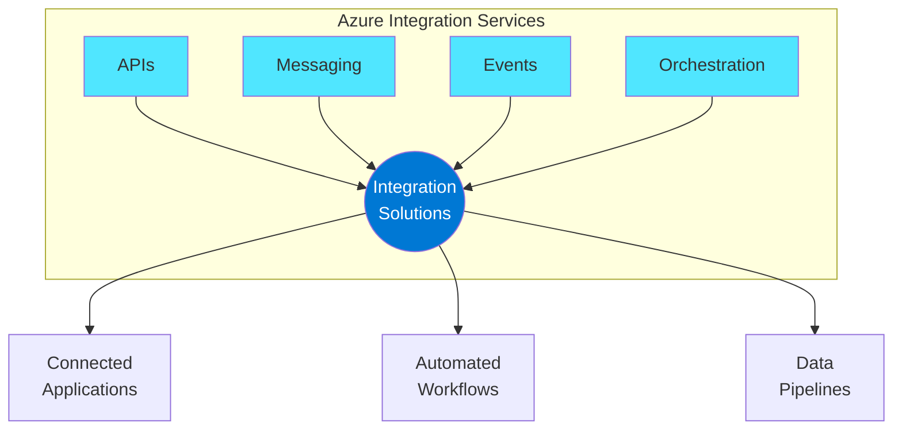

# Azure Integration Services Workshop

A hands-on workshop covering Azure's comprehensive suite of integration services for building modern, event-driven, and scalable solutions.

## Overview

## Workshop Modules

| Module | Description |
|--------|-------------|
| [00 - Overview](docs/00-azure-integration-services-overview.md) | Introduction to the four pillars of integration and architecture patterns |
| [01 - API Management](docs/01-azure-api-management.md) | Secure API publishing, gateway features, and developer portals |
| [02 - Logic Apps](docs/02-azure-logic-apps.md) | Workflow automation and business process orchestration |
| [03 - Service Bus](docs/03-azure-service-bus.md) | Enterprise messaging with queues and topics |
| [04 - Event Grid](docs/04-azure-event-grid.md) | Event routing for reactive architectures |
| [05 - Azure Functions](docs/05-azure-functions.md) | Serverless compute for event-driven processing |
| [06 - Data Factory](docs/06-azure-data-factory.md) | ETL/ELT and data pipeline orchestration |
| [07 - Service Comparison](docs/07-service-comparison.md) | Decision framework for choosing the right service |
| [08 - Sample Recommendations](docs/08-sample-recommendations.md) | Curated samples and reference implementations |

## Quick Start

1. Start with the [Overview](docs/00-azure-integration-services-overview.md) to understand integration fundamentals
2. Explore individual services based on your use case
3. Use the [Service Comparison](docs/07-service-comparison.md) guide to select the right tools
4. Check [Sample Recommendations](docs/08-sample-recommendations.md) for hands-on examples

## License

This project is licensed under the MIT License - see the [LICENSE](LICENSE) file for details.
