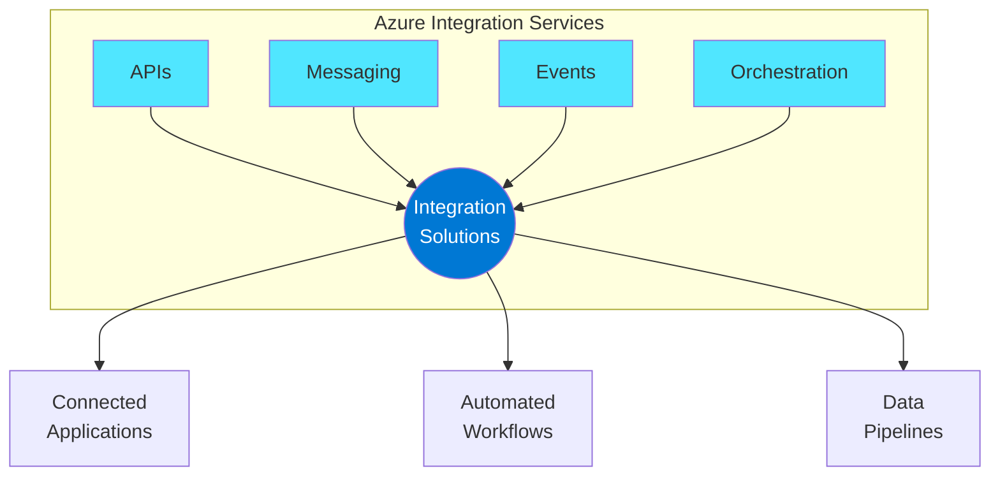
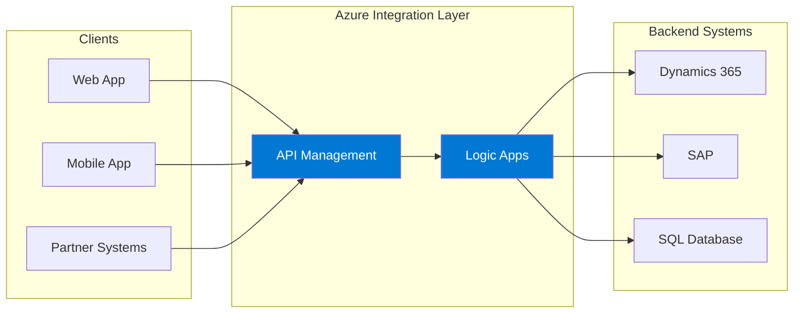
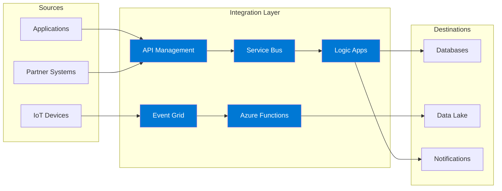
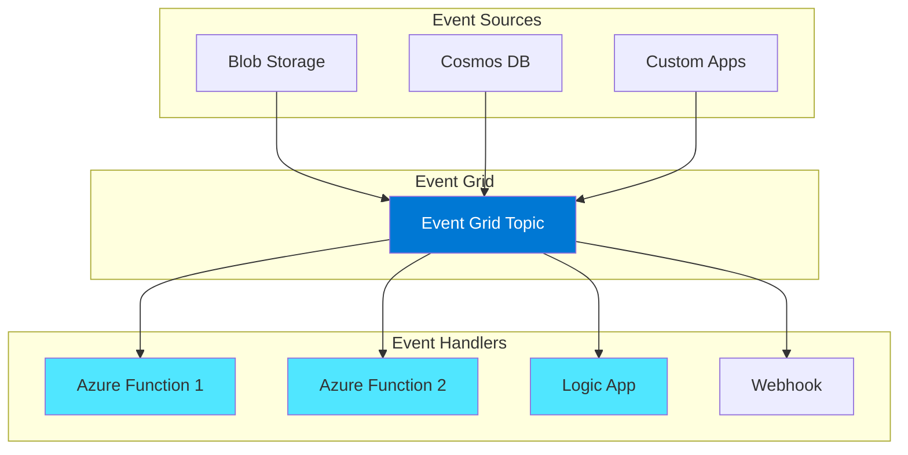
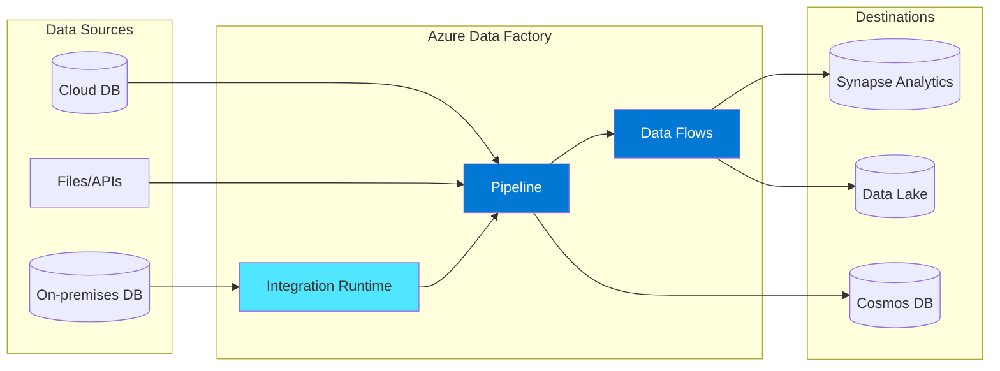
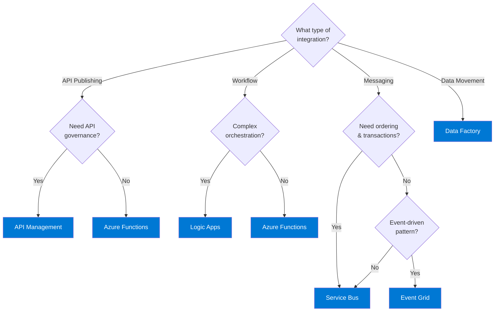

# Azure Integration Services Overview

## Introduction

Azure Integration Services is a comprehensive suite of cloud-based tools designed to connect applications, data, services, and devices. These services enable organizations to build modern, event-driven, and scalable integration solutions that work across on-premises, cloud, and hybrid environments.

The purpose of integration is to bring workflows together so they're consistent and scalable, allowing businesses to connect applications, data, and processes in a fast, efficient, and automated manner.

## The Four Pillars of Integration

Integration solutions typically rely on four core technologies:

| Pillar | Description | Azure Service |
|--------|-------------|---------------|
| **APIs** | Direct synchronous communication between services | Azure API Management |
| **Messaging** | Asynchronous communication with guaranteed delivery | Azure Service Bus |
| **Events** | Reactive programming and event-driven architectures | Azure Event Grid |
| **Orchestration** | Workflow automation and business process management | Azure Logic Apps |

## Azure Integration Services Portfolio

### Core Services

| Service | Description | Primary Use Cases |
|---------|-------------|-------------------|
| **[Azure API Management](./01-azure-api-management.md)** | Securely publish APIs for internal and external developers | API gateway, developer portal, API monetization |
| **[Azure Logic Apps](./02-azure-logic-apps.md)** | Create automated workflows to connect services | Business process automation, B2B integration |
| **[Azure Service Bus](./03-azure-service-bus.md)** | Enterprise message broker with queues and pub/sub | Decoupling applications, load leveling |
| **[Azure Event Grid](./04-azure-event-grid.md)** | Event routing service for event-driven architectures | Reactive programming, serverless triggers |
| **[Azure Functions](./05-azure-functions.md)** | Serverless compute for event-driven code | Microservices, data processing, automation |
| **[Azure Data Factory](./06-azure-data-factory.md)** | Cloud data integration service | ETL/ELT, data pipelines, data orchestration |

## Integration Architecture Patterns

### Pattern 1: Basic Enterprise Integration

**When to use:** Synchronous calls to enterprise back-end systems with API governance.

### Pattern 2: Asynchronous Enterprise Integration

**When to use:** Handle bursts in workload, decouple applications, and enable reliable state transition management.

### Pattern 3: Event-Driven Serverless Architecture

**When to use:** Reactive programming, serverless architectures, and real-time event processing.

### Pattern 4: Data Integration Pipeline

**When to use:** ETL/ELT processes, data movement, and transformation at scale.

## Key Benefits

### 1. **Reduced Complexity**
- Pre-built connectors for 400+ services
- Low-code/no-code options
- Managed infrastructure

### 2. **Scalability**
- Automatic scaling based on demand
- Global distribution capabilities
- High availability options

### 3. **Security**
- Enterprise-grade security
- Integration with Azure Active Directory
- Virtual network support
- Compliance certifications

### 4. **Cost Efficiency**
- Pay-per-use pricing models
- Serverless options
- Optimized resource utilization

## Integration Decision Tree

## Getting Started

### Prerequisites
- Azure subscription
- Basic understanding of REST APIs
- Familiarity with JSON/XML

### Learning Path Recommendations

| Level | Focus Area | Resources |
|-------|------------|-----------|
| **L100** | Fundamentals | Service overviews, basic concepts |
| **L200** | Implementation | Hands-on labs, connectors, basic patterns |
| **L300** | Architecture | Enterprise patterns, security, governance |
| **L400** | Advanced | Performance optimization, DR, complex patterns |

## Workshop Structure

This workshop covers the following topics:

1. **[Azure API Management](./01-azure-api-management.md)** - API gateway and management
2. **[Azure Logic Apps](./02-azure-logic-apps.md)** - Workflow automation
3. **[Azure Service Bus](./03-azure-service-bus.md)** - Enterprise messaging
4. **[Azure Event Grid](./04-azure-event-grid.md)** - Event routing
5. **[Azure Functions](./05-azure-functions.md)** - Serverless compute
6. **[Azure Data Factory](./06-azure-data-factory.md)** - Data integration
7. **[Service Comparison Guide](./07-service-comparison.md)** - When to use each service

---

## References

- [Integration architecture design - Azure Architecture Center](https://learn.microsoft.com/en-us/azure/architecture/integration/integration-start-here)
- [Azure Integration Services](https://azure.microsoft.com/en-us/products/category/integration/)
- [Enterprise integration using message broker and events](https://learn.microsoft.com/en-us/azure/architecture/example-scenario/integration/queues-events)
- [Basic enterprise integration on Azure](https://learn.microsoft.com/en-us/azure/architecture/reference-architectures/enterprise-integration/basic-enterprise-integration)
- [Choose between Azure Integration Services](https://learn.microsoft.com/en-us/azure/logic-apps/azure-integration-services-choose-capabilities)
