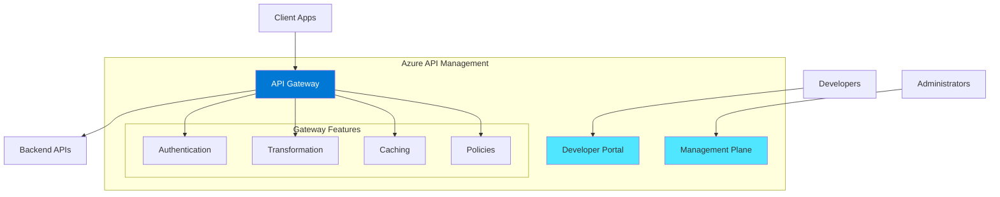
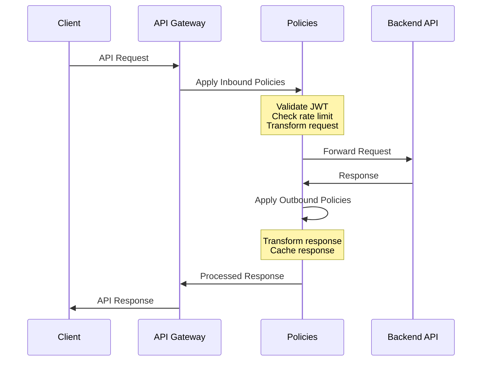
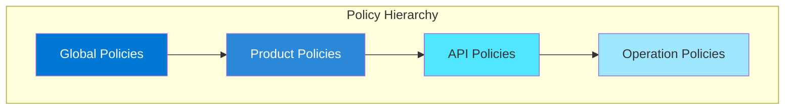
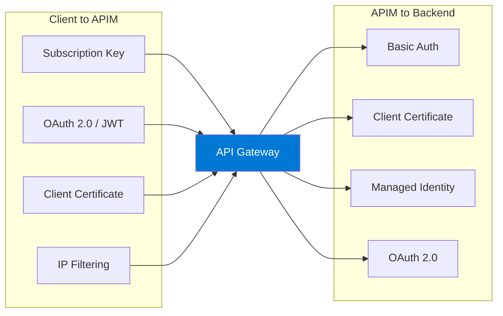
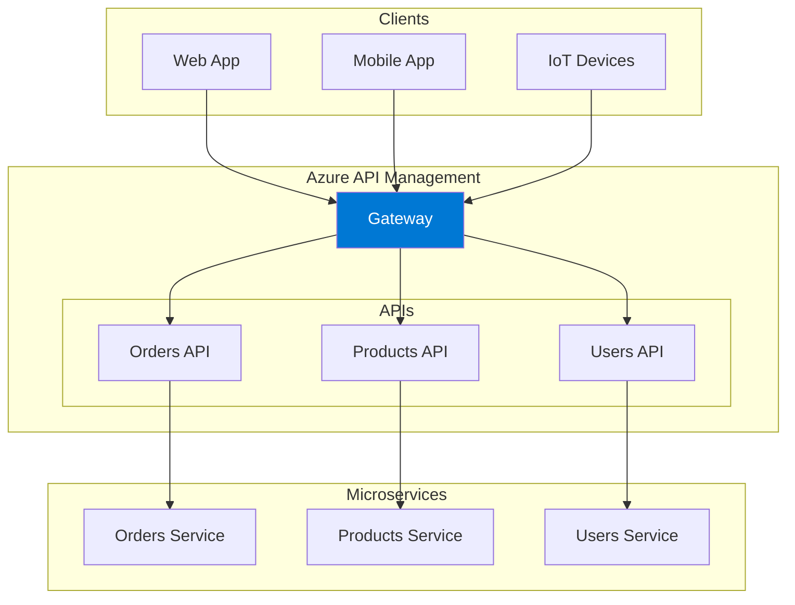
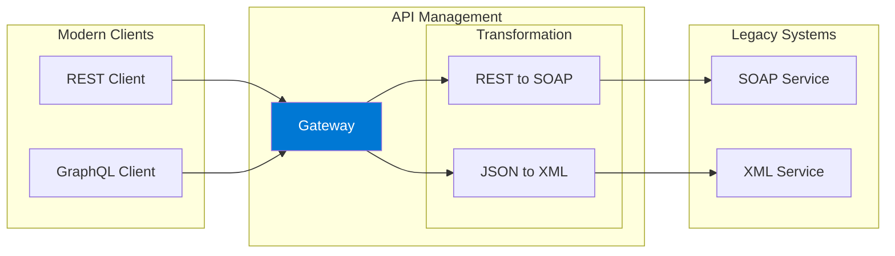
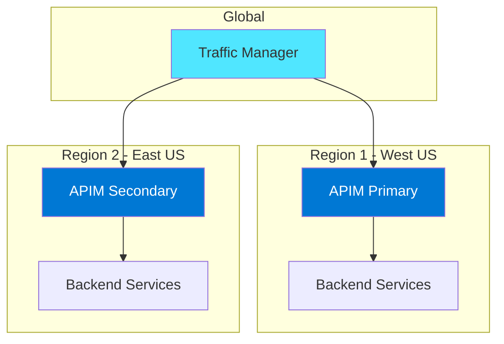
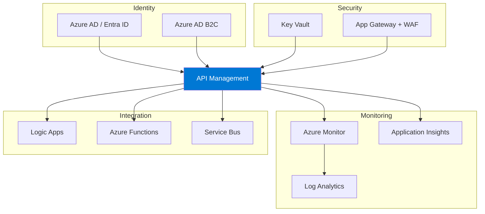

# Azure API Management (APIM)

## Overview

Azure API Management (APIM) is a hybrid, multicloud management platform for APIs across all environments. As a platform-as-a-service, API Management supports the complete API lifecycle from design, development, publishing, operations, to retirement.

APIM helps organizations publish APIs to external, partner, and internal developers to unlock the potential of their data and services. It provides tools for securing, managing, and scaling API calls while offering a unified management experience and full observability.

## Key Components



### 1. API Gateway
- Routes API calls to backends
- Verifies API keys and credentials
- Enforces usage quotas and rate limits
- Transforms requests and responses
- Caches responses
- Logs for analytics

### 2. Developer Portal
- Auto-generated, customizable portal
- API documentation and interactive console
- Self-service subscription management
- Analytics dashboards

### 3. Management Plane
- API definition and configuration
- User and group management
- Policy configuration
- Analytics and reporting

## Service Tiers

| Tier | Description | Use Case | Key Features |
|------|-------------|----------|--------------|
| **Consumption** | Serverless, pay-per-execution | Variable traffic, microservices | Auto-scaling, no idle cost |
| **Developer** | Non-production | Development/testing | No SLA, lower cost |
| **Basic** | Entry-level production | Small workloads | SLA, limited scale |
| **Basic v2** | Development and testing | Dev/test with SLA | Fast provisioning, SLA |
| **Standard** | Production | Medium workloads | Azure AD, higher limits |
| **Standard v2** | Production | VNet integration needed | Network isolation, fast scaling |
| **Premium** | Enterprise | Multi-region, VNET | Multi-region, availability zones |
| **Premium v2** | Enterprise | Full VNet isolation | Workspaces, 30 units max |

### V2 Tiers Benefits
- **Faster deployment** - Production-ready in minutes
- **Simplified networking** - VNet integration and private endpoints
- **Better scaling** - Up to 10 units (Basic/Standard v2) or 30 units (Premium v2)
- **Developer portal options** - Enable when needed

## How APIM Works



## Policies

Policies are a powerful capability that allows publishers to change API behavior through configuration. They execute sequentially on the request or response.

### Policy Scopes



### Common Policy Categories

| Category | Policies | Description |
|----------|----------|-------------|
| **Access Restriction** | IP filtering, validate JWT, check HTTP header | Control access to APIs |
| **Authentication** | Basic auth, certificate auth, managed identity | Authenticate to backends |
| **Caching** | Store/retrieve from cache | Reduce backend load |
| **Transformation** | Set/rewrite headers, convert XML to JSON | Modify requests/responses |
| **Rate Limiting** | Rate limit by key/subscription, quota | Protect backends |
| **Advanced** | Mock responses, retry, send requests | Complex scenarios |

### Policy Example: Rate Limiting

```xml
<policies>
    <inbound>
        <base />
        <!-- Limit to 100 calls per minute per subscription -->
        <rate-limit calls="100" renewal-period="60" />
        <!-- Set quota of 10000 calls per week -->
        <quota calls="10000" renewal-period="604800" />
    </inbound>
    <backend>
        <base />
    </backend>
    <outbound>
        <base />
    </outbound>
    <on-error>
        <base />
    </on-error>
</policies>
```

### Policy Example: JWT Validation

```xml
<policies>
    <inbound>
        <validate-jwt header-name="Authorization" 
                      failed-validation-httpcode="401"
                      failed-validation-error-message="Unauthorized">
            <openid-config url="https://login.microsoftonline.com/{tenant}/.well-known/openid-configuration" />
            <audiences>
                <audience>api://your-api-id</audience>
            </audiences>
            <required-claims>
                <claim name="roles" match="any">
                    <value>API.Reader</value>
                    <value>API.Writer</value>
                </claim>
            </required-claims>
        </validate-jwt>
        <base />
    </inbound>
</policies>
```

## Authentication & Security

### Authentication Methods



### Security Best Practices

1. **Use OAuth 2.0/OpenID Connect** for API authorization
2. **Enable HTTPS only** - disable HTTP
3. **Use managed identities** to authenticate to backends
4. **Store secrets in Key Vault** - reference certificates and secrets
5. **Implement rate limiting** to prevent abuse
6. **Use VNet integration** for network isolation
7. **Enable diagnostic logging** to Azure Monitor

## Architecture Patterns

### Pattern 1: API Gateway for Microservices



### Pattern 2: API Façade for Legacy Systems



### Pattern 3: Multi-Region Deployment



## Main Use Cases

### 1. API Monetization
- Publish APIs to partners and developers
- Implement usage-based billing
- Track API consumption

### 2. Internal API Gateway
- Standardize internal API access
- Implement consistent security
- Monitor API usage

### 3. Legacy Modernization
- Expose legacy services as REST APIs
- Transform protocols and formats
- Gradual migration path

### 4. Multi-Cloud API Management
- Self-hosted gateway for Kubernetes
- On-premises API management
- Hybrid cloud scenarios

## Best Practices

### Design

| Practice | Description |
|----------|-------------|
| **Version your APIs** | Use URL path or header versioning |
| **Use products** | Group APIs logically for subscription management |
| **Design for security** | Apply defense in depth |
| **Plan for scale** | Choose appropriate tier and configure auto-scaling |

### Operations

| Practice | Description |
|----------|-------------|
| **Monitor performance** | Use Azure Monitor and Application Insights |
| **Set up alerts** | For errors, latency, and capacity |
| **Backup configurations** | Regular exports and IaC |
| **Test policies** | Use test console and automated tests |

### Security

| Practice | Description |
|----------|-------------|
| **Use OAuth 2.0** | For API authorization |
| **Store secrets in Key Vault** | Never hardcode credentials |
| **Enable WAF** | Use Application Gateway with WAF |
| **Regular audits** | Review access and permissions |

## Integration with Other Services



## Pricing Considerations

| Factor | Impact |
|--------|--------|
| **Tier selection** | Fixed monthly cost (Classic) vs. pay-per-call (Consumption) |
| **Scale units** | Additional cost per unit |
| **Self-hosted gateways** | Per gateway cost |
| **Workspaces** | Additional workspace gateway costs |
| **Data transfer** | Outbound data costs |

## Hands-On Lab Ideas

1. **Create your first API** - Import an OpenAPI specification
2. **Implement authentication** - Add OAuth 2.0 with Azure AD
3. **Configure policies** - Rate limiting and caching
4. **Set up monitoring** - Azure Monitor and alerts
5. **Deploy multi-region** - Traffic Manager integration

---

## References

- [Azure API Management Documentation](https://learn.microsoft.com/en-us/azure/api-management/)
- [API Management Key Concepts](https://learn.microsoft.com/en-us/azure/api-management/api-management-key-concepts)
- [API Management Policies Reference](https://learn.microsoft.com/en-us/azure/api-management/api-management-policies)
- [V2 Service Tiers](https://learn.microsoft.com/en-us/azure/api-management/v2-service-tiers-overview)
- [Authentication and Authorization](https://learn.microsoft.com/en-us/azure/api-management/authentication-authorization-overview)
- [API Management Best Practices](https://learn.microsoft.com/en-us/azure/well-architected/service-guides/azure-api-management)
- [Protect APIs with Application Gateway](https://learn.microsoft.com/en-us/azure/architecture/web-apps/api-management/architectures/protect-apis)
