# Azure Logic Apps

## Overview

Azure Logic Apps is a cloud-based platform for creating and running automated workflows that integrate apps, data, services, and systems. It enables developers and IT professionals to automate business processes and integrate systems without writing code, using a visual designer with hundreds of pre-built connectors.

Logic Apps supports both low-code and pro-code approaches, making it accessible for citizen developers while providing the power needed for enterprise integration scenarios.

## Hosting Options

Azure Logic Apps offers two main hosting options:

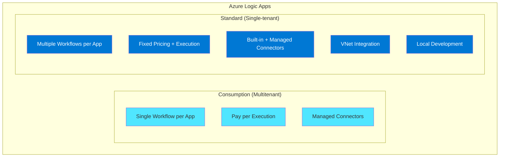

### Comparison: Consumption vs Standard

| Feature | Consumption | Standard |
|---------|-------------|----------|
| **Workflows per app** | 1 | Multiple |
| **Pricing model** | Pay per execution | Fixed + execution |
| **Environment** | Multitenant | Single-tenant |
| **VNet integration** | Limited | Full support |
| **Local development** | Limited | VS Code support |
| **Deployment** | Azure Portal, ARM | CI/CD, containers |
| **Stateful/Stateless** | Stateful only | Both |
| **Performance** | Good | Better (proximity) |
| **Built-in connectors** | Limited | Extensive |

## Key Concepts

### Workflow Structure

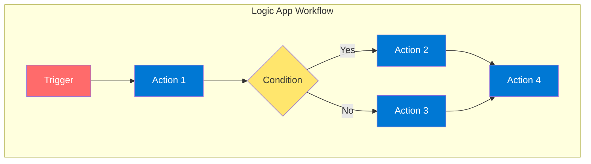

### Triggers

Triggers start your workflow and come in several types:

| Trigger Type | Description | Example |
|--------------|-------------|---------|
| **Recurrence** | Time-based schedule | Run every hour |
| **Request** | HTTP endpoint | Webhook receiver |
| **Polling** | Check for changes | New email arrives |
| **Push** | Event-based | Service Bus message |
| **Manual** | On-demand | Test or admin trigger |

### Actions

Actions perform tasks in your workflow:

| Action Type | Description | Examples |
|-------------|-------------|----------|
| **Built-in** | Native to Logic Apps | HTTP, Condition, Loop |
| **Managed** | Microsoft-hosted connectors | Office 365, SQL |
| **Custom** | Your own APIs | Custom connector |
| **Control** | Flow control | Switch, ForEach, Scope |

### Connectors

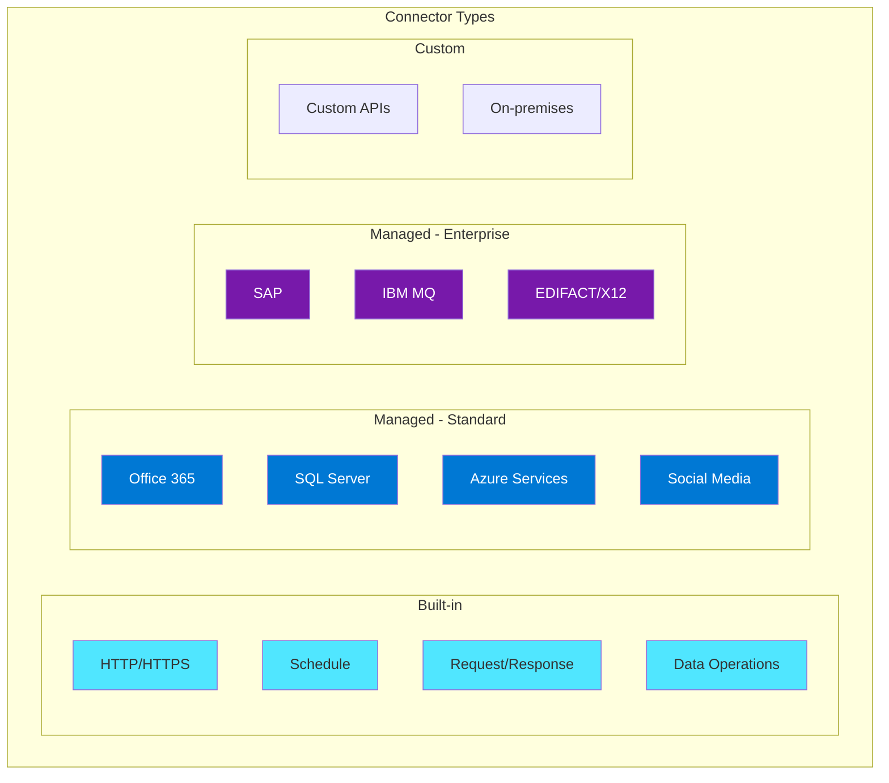

## Workflow Patterns

### Pattern 1: Request-Response

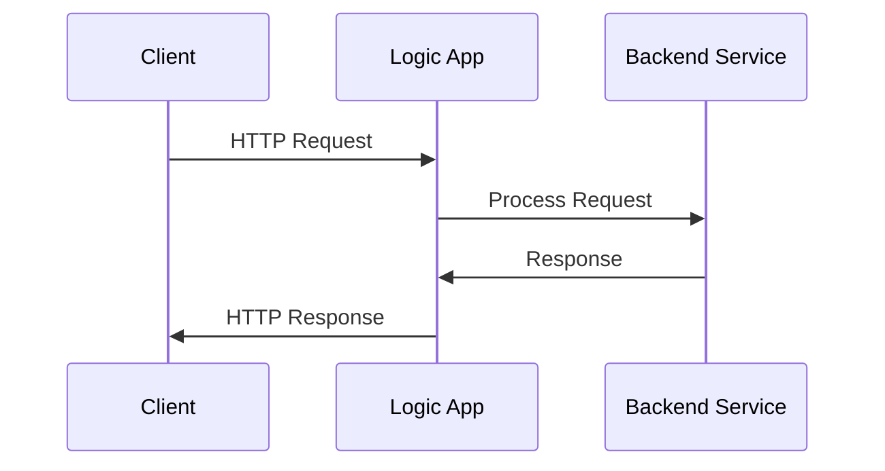

```json
{
    "definition": {
        "triggers": {
            "manual": {
                "type": "Request",
                "kind": "Http",
                "inputs": {
                    "schema": {}
                }
            }
        },
        "actions": {
            "Response": {
                "type": "Response",
                "inputs": {
                    "statusCode": 200,
                    "body": "@triggerBody()"
                }
            }
        }
    }
}
```

### Pattern 2: Event-Driven Processing

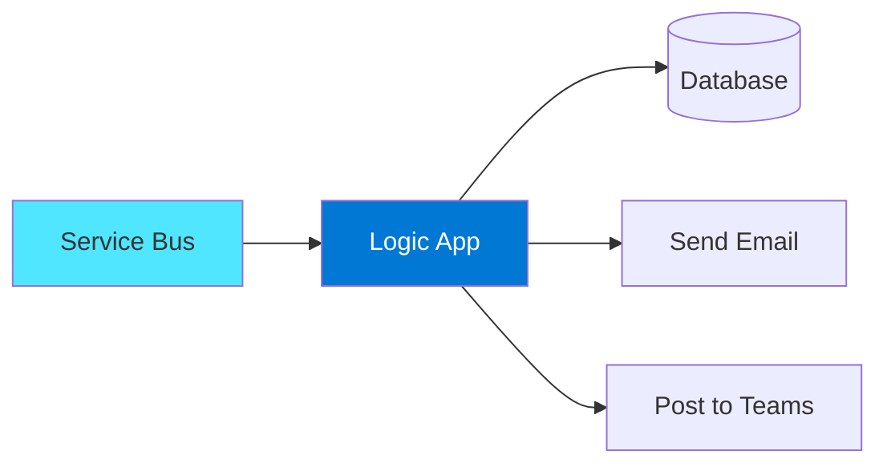

### Pattern 3: Scheduled Data Sync

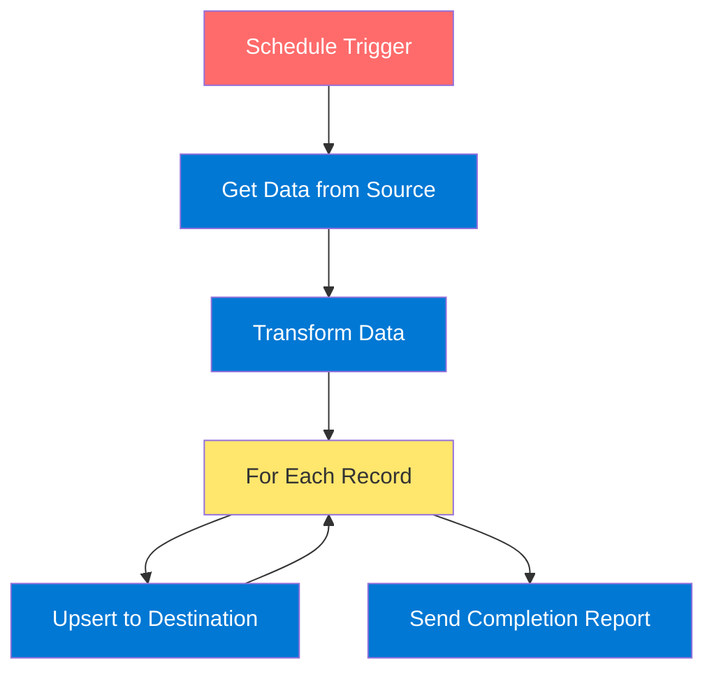

### Pattern 4: Approval Workflow

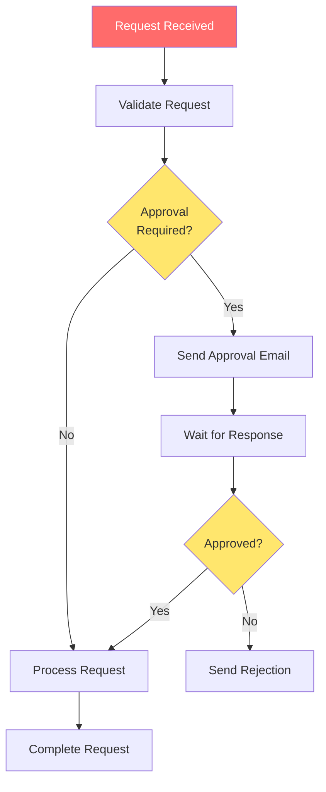

## Control Flow Actions

### Conditions

```json
{
    "Condition": {
        "type": "If",
        "expression": {
            "and": [
                {
                    "greater": ["@body('Get_item')?['amount']", 1000]
                }
            ]
        },
        "actions": {
            "High_value_processing": {}
        },
        "else": {
            "actions": {
                "Standard_processing": {}
            }
        }
    }
}
```

### Loops

| Loop Type | Description | Use Case |
|-----------|-------------|----------|
| **For Each** | Iterate over arrays | Process each item |
| **Until** | Loop until condition | Retry logic |
| **Do Until** | Loop with condition check | Polling scenarios |

### Scopes and Error Handling

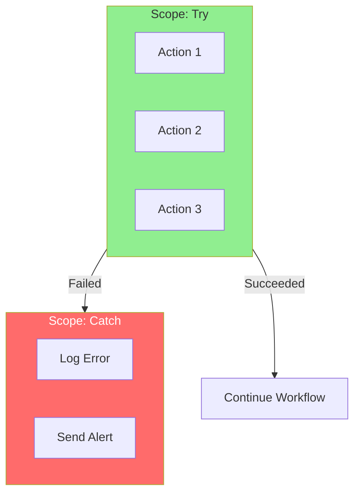

## Enterprise Integration

### B2B Capabilities

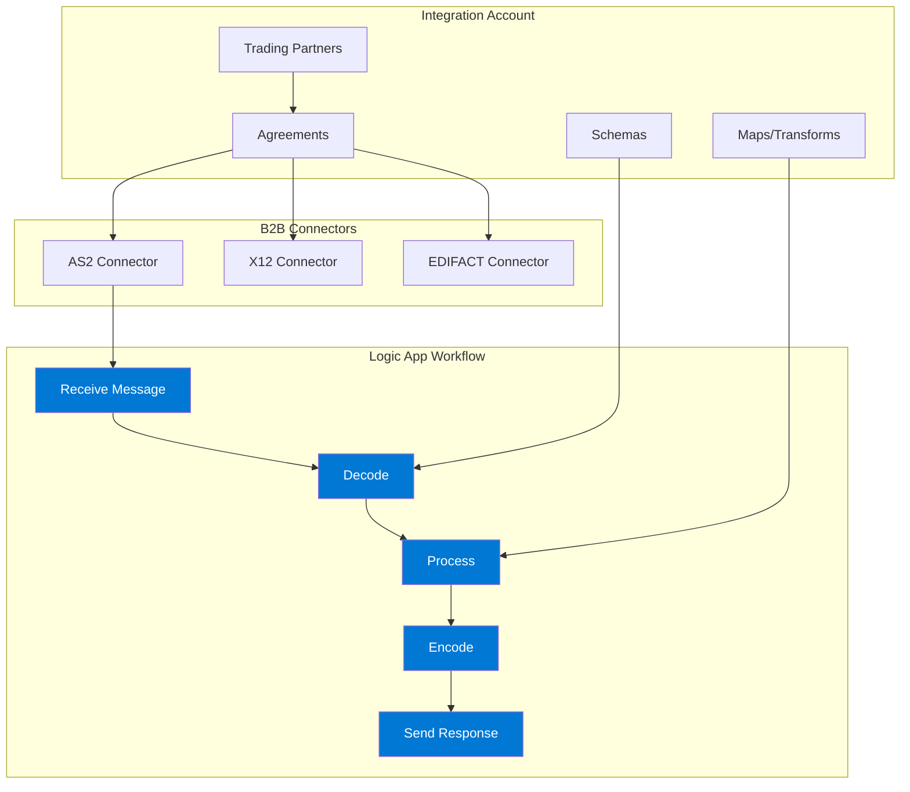

### Integration Account Features

| Feature | Description |
|---------|-------------|
| **Partners** | Define trading partner identities |
| **Agreements** | Protocol settings (AS2, X12, EDIFACT) |
| **Schemas** | XML/JSON schemas for validation |
| **Maps** | XSLT/Liquid transforms |
| **Certificates** | Security certificates for B2B |

## Standard Logic Apps - Advanced Features

### Stateless Workflows
- No run history persistence
- Lower latency
- Higher throughput
- Ideal for request-response scenarios

### Built-in Connectors (Standard)
More connectors run in-process for better performance:
- Azure Service Bus
- Azure Event Hubs
- Azure Storage
- SQL Server
- Azure Cosmos DB
- HTTP operations

### Local Development with VS Code

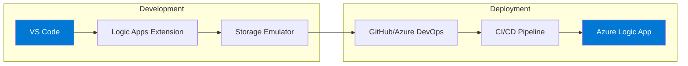

## Security

### Authentication Options

| Method | Description | Use Case |
|--------|-------------|----------|
| **Managed Identity** | Azure AD identity | Access Azure resources |
| **OAuth 2.0** | Token-based auth | API connections |
| **API Key** | Shared secret | Simple authentication |
| **Client Certificate** | Certificate-based | High-security scenarios |
| **Azure AD** | Enterprise identity | Internal applications |

### Security Best Practices

1. **Use Managed Identities** for Azure resource access
2. **Secure HTTP triggers** with Azure AD or SAS tokens
3. **Enable VNet integration** for network isolation (Standard)
4. **Store secrets in Key Vault** and reference them
5. **Enable diagnostic logging** for audit trails
6. **Use IP restrictions** where applicable

## Monitoring and Observability

### Run History

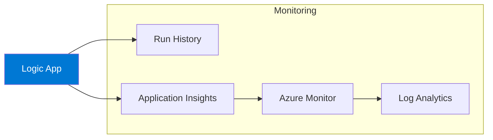

### Key Metrics to Monitor

| Metric | Description |
|--------|-------------|
| **Run success rate** | Percentage of successful runs |
| **Run latency** | Execution time |
| **Trigger success rate** | Trigger fire success |
| **Actions failed** | Number of failed actions |
| **Billable executions** | For cost tracking |

## Best Practices

### Design

| Practice | Description |
|----------|-------------|
| **Use scopes** | Group related actions for error handling |
| **Implement retry policies** | Handle transient failures |
| **Use inline code** | For simple transformations |
| **Parameterize values** | For environment-specific configs |
| **Design for idempotency** | Handle duplicate messages |

### Performance

| Practice | Description |
|----------|-------------|
| **Use batching** | Process multiple items together |
| **Optimize loops** | Use parallel processing |
| **Choose Standard** | For high-throughput scenarios |
| **Minimize connector calls** | Combine operations where possible |
| **Use built-in connectors** | Better performance than managed |

### Operations

| Practice | Description |
|----------|-------------|
| **Enable diagnostics** | Send logs to Log Analytics |
| **Set up alerts** | For failures and performance |
| **Use CI/CD** | Automated deployments |
| **Version workflows** | Track changes in source control |

## Architecture Patterns

### Pattern: Event-Driven Architecture

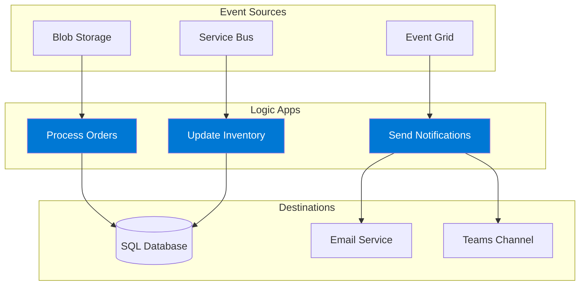

### Pattern: API Orchestration

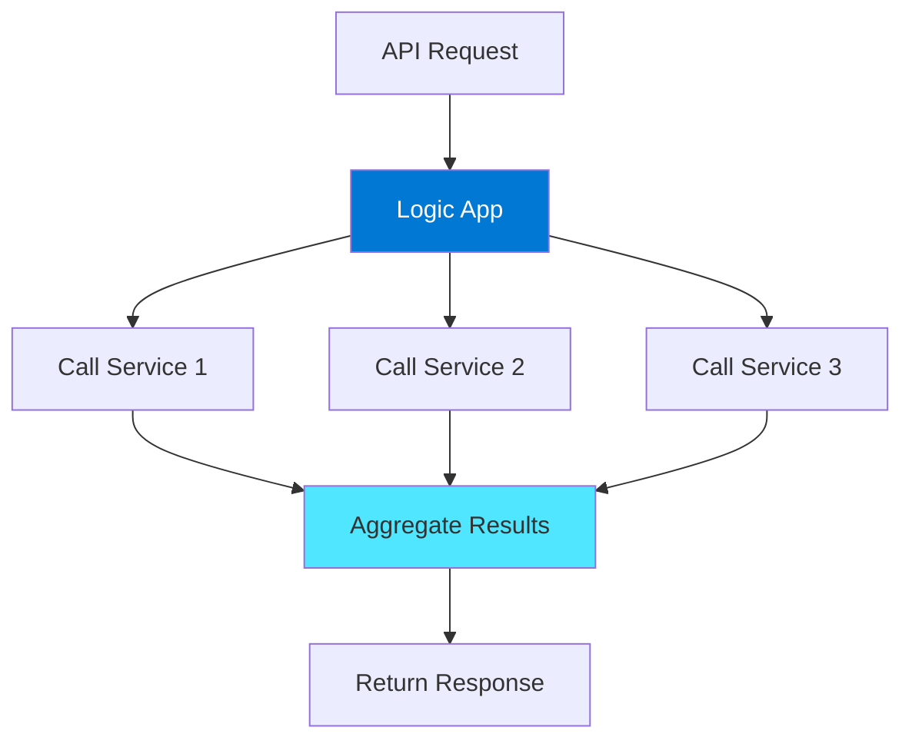

## Pricing Considerations

### Consumption Logic Apps
- Pay per action execution
- Trigger executions
- Connector usage (Standard vs Enterprise)
- Integration account (for B2B)

### Standard Logic Apps
- Base compute cost (like App Service)
- Additional execution costs
- Storage costs
- VNet integration costs (if used)

## Hands-On Lab Ideas

1. **Create a request-response workflow** - Build an HTTP-triggered API
2. **Implement approval workflow** - Using Office 365 connectors
3. **Build data sync** - Schedule-based data movement
4. **B2B integration** - EDI message processing
5. **Event-driven processing** - Service Bus integration

---

## References

- [Azure Logic Apps Documentation](https://learn.microsoft.com/en-us/azure/logic-apps/)
- [What is Azure Logic Apps?](https://learn.microsoft.com/en-us/azure/logic-apps/logic-apps-overview)
- [Single-tenant vs Multitenant](https://learn.microsoft.com/en-us/azure/logic-apps/single-tenant-overview-compare)
- [Connectors Reference](https://learn.microsoft.com/en-us/connectors/connector-reference/connector-reference-logicapps-connectors)
- [Logic Apps Pricing](https://azure.microsoft.com/en-us/pricing/details/logic-apps/)
- [Business Continuity and DR](https://learn.microsoft.com/en-us/azure/logic-apps/business-continuity-disaster-recovery-guidance)
- [Power Automate Migration Guide](https://learn.microsoft.com/en-us/azure/logic-apps/power-automate-migration)
