# Azure Service Bus

## Overview

Azure Service Bus is a fully managed enterprise message broker that provides reliable cloud messaging as a service (MaaS) and simple hybrid integration. It supports both queue-based point-to-point messaging and publish-subscribe patterns through topics and subscriptions.

Service Bus is designed for enterprise applications requiring high reliability, ordered delivery, and transactional support. It's a core component of Azure Integration Services, enabling asynchronous and decoupled communication between applications.

## Core Concepts

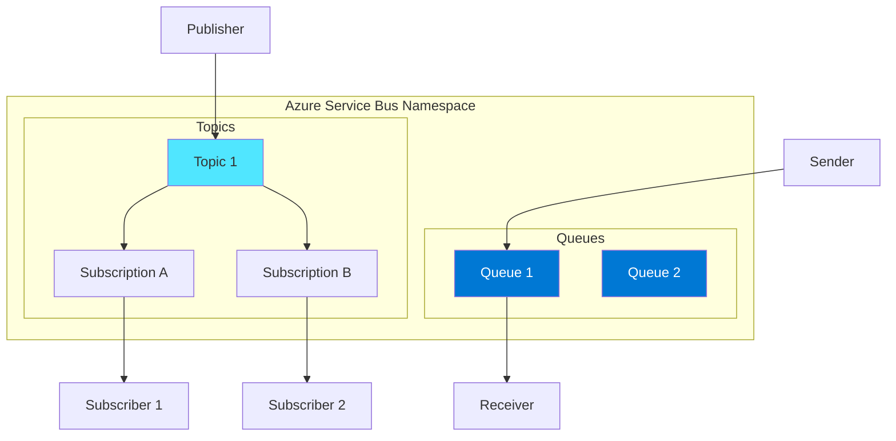

### Queues vs Topics

| Feature | Queues | Topics |
|---------|--------|--------|
| **Pattern** | Point-to-point | Publish-subscribe |
| **Receivers** | Single receiver | Multiple subscriptions |
| **Message delivery** | One consumer | Each subscription gets copy |
| **Use case** | Load leveling, decoupling | Broadcasting, fan-out |

## Messaging Patterns

### Pattern 1: Point-to-Point (Queues)

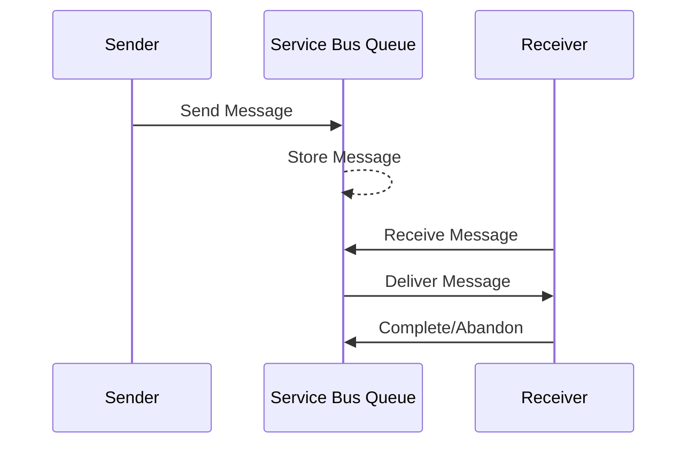

### Pattern 2: Publish-Subscribe (Topics)

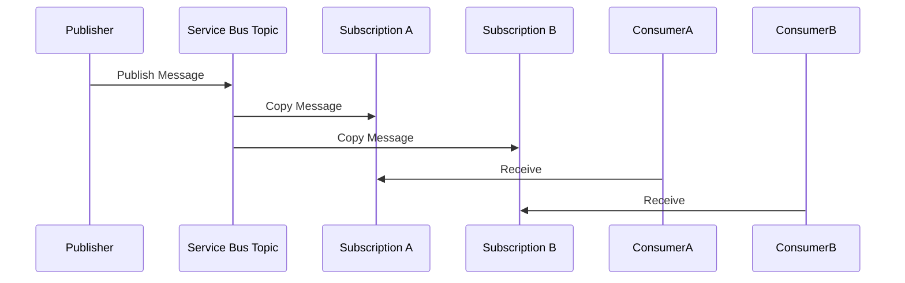

### Pattern 3: Request-Reply

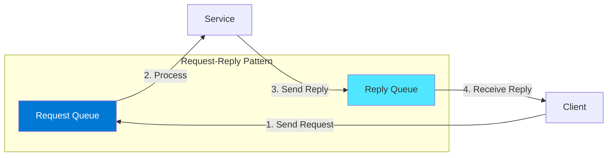

## Message Features

### Message Structure

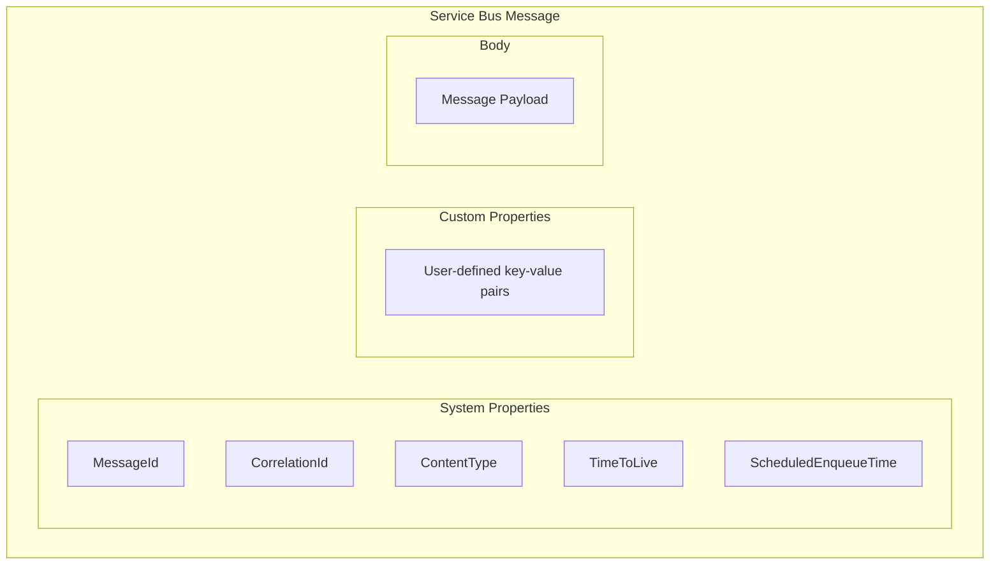

### Key Message Properties

| Property | Description | Use Case |
|----------|-------------|----------|
| **MessageId** | Unique identifier | Deduplication |
| **CorrelationId** | Correlation tracking | Request-reply |
| **SessionId** | Session identifier | FIFO, grouping |
| **TimeToLive** | Message expiration | Cleanup |
| **ScheduledEnqueueTime** | Delayed delivery | Scheduled processing |
| **ReplyTo** | Reply destination | Request-reply |
| **Label** | Message label/subject | Filtering |

## Advanced Features

### Sessions (FIFO Guaranteed)

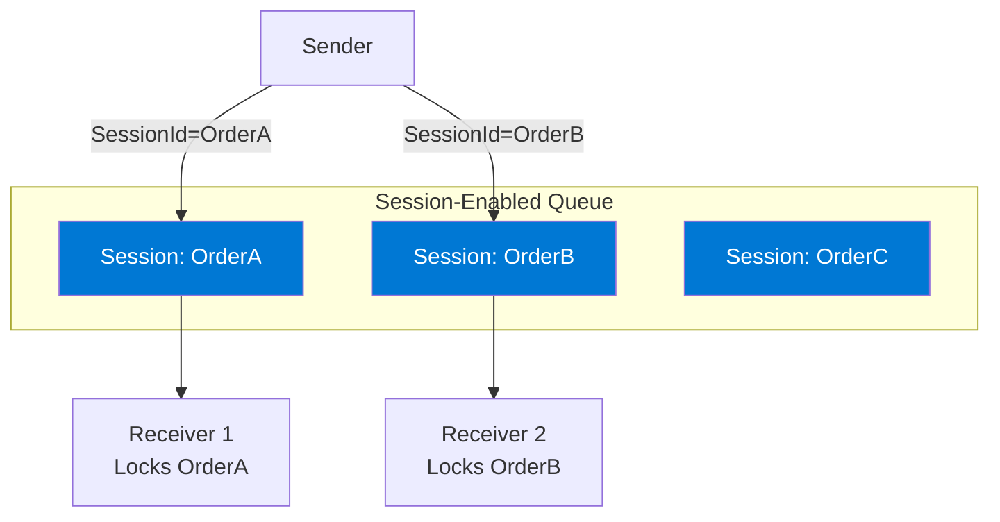

**Session Benefits:**
- Guaranteed FIFO within session
- Session state management
- Exclusive receiver per session
- Session locking

### Dead-Letter Queue (DLQ)

The Dead-Letter Queue is a secondary sub-queue that holds messages which cannot be delivered or processed successfully. Every queue and topic subscription has an associated DLQ that is automatically created and managed by Service Bus.

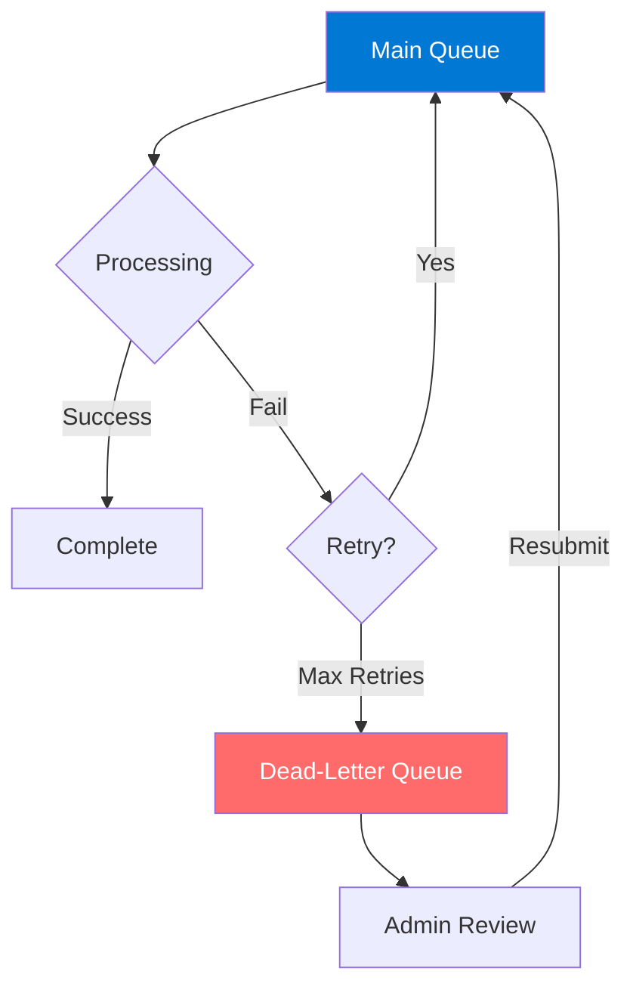

#### When Messages Are Sent to DLQ

**Automatic Dead-Lettering:**

| Scenario | Description | Configuration |
|----------|-------------|---------------|
| **Max Delivery Count Exceeded** | Message received and abandoned more times than `MaxDeliveryCount` (default: 10) | Set `MaxDeliveryCount` on queue/subscription |
| **Message Expiration (TTL)** | Message exceeds its TimeToLive value | Enable `DeadLetteringOnMessageExpiration` |
| **Subscription Filter Errors** | Filter cannot be evaluated on a subscription | Enable `EnableDeadLetteringOnFilterEvaluationExceptions` |
| **Session State Size Exceeded** | Session state exceeds 1 MB limit | N/A - system enforced |

**Explicit Dead-Lettering:**
- Application code calls `DeadLetterAsync()` when business logic determines a message cannot be processed

#### Dead-Letter Reason Codes

| Reason | Description |
|--------|-------------|
| `MaxDeliveryCountExceeded` | Too many delivery attempts failed |
| `TTLExpiredException` | Message time-to-live expired |
| `HeaderSizeExceeded` | Message headers too large |
| `SessionIdIsMissing` | Session-enabled queue received non-session message |

#### Accessing the Dead-Letter Queue

The DLQ path follows the format: `<queue-name>/$deadletterqueue` or `<topic>/<subscription>/$deadletterqueue`

```csharp
// Create a receiver for the dead-letter queue
var dlqPath = ServiceBusReceiverClient.FormatDeadLetterPath(queueName);
var dlqReceiver = client.CreateReceiver(dlqPath);

// Receive dead-lettered messages
var messages = await dlqReceiver.ReceiveMessagesAsync(maxMessages: 10);

foreach (var message in messages)
{
    // Inspect dead-letter reason
    var reason = message.DeadLetterReason;
    var description = message.DeadLetterErrorDescription;
    
    Console.WriteLine($"DLQ Reason: {reason}, Description: {description}");
    
    // Process or resubmit the message
    await dlqReceiver.CompleteMessageAsync(message);
}
```

#### Explicitly Dead-Lettering Messages

```csharp
// Dead-letter a message with custom reason
await receiver.DeadLetterMessageAsync(
    message,
    deadLetterReason: "InvalidPayload",
    deadLetterErrorDescription: "Message format was invalid - missing required fields"
);
```

#### Best Practices for DLQ Management

- **Monitor DLQ regularly** - Set up alerts for messages in DLQ
- **Implement DLQ processors** - Create background jobs to handle dead-lettered messages
- **Log dead-letter reasons** - Track patterns to fix root causes
- **Set appropriate MaxDeliveryCount** - Balance between retry attempts and quick failure detection
- **Consider automatic cleanup** - Set TTL on DLQ messages to prevent unlimited growth

### Message Forwarding

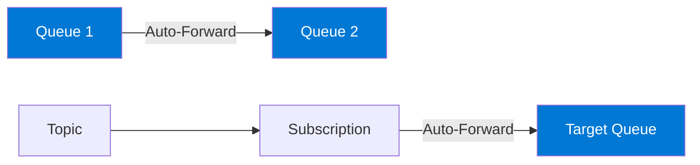

### Scheduled Messages

```csharp
// Schedule a message for future delivery
var message = new ServiceBusMessage("Scheduled content");
var scheduledTime = DateTimeOffset.UtcNow.AddHours(1);

long sequenceNumber = await sender.ScheduleMessageAsync(
    message, 
    scheduledTime
);

// Cancel if needed
await sender.CancelScheduledMessageAsync(sequenceNumber);
```

### Duplicate Detection

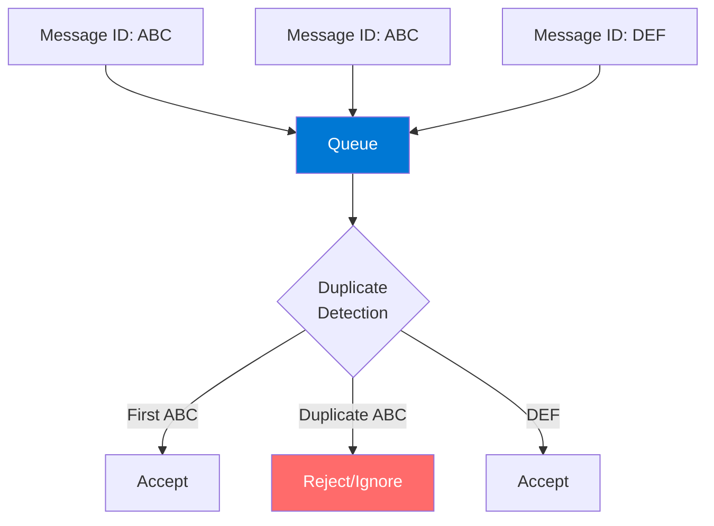

## Subscription Filters

### Filter Types

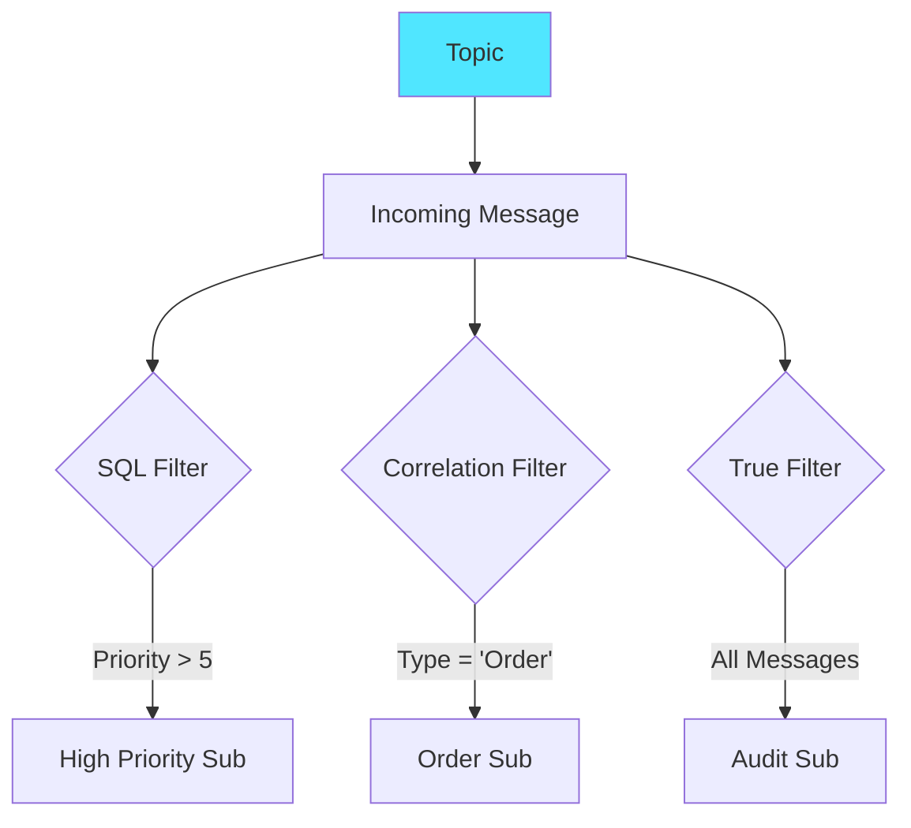

### SQL Filter Examples

```sql
-- Filter by custom property
Priority > 5

-- Filter by system property
sys.Label = 'Important'

-- Complex filter
Priority > 3 AND Region = 'US' AND Amount > 1000

-- NULL check
OrderType IS NOT NULL
```

### Correlation Filter

```csharp
// Efficient property-based filtering
var filter = new CorrelationRuleFilter
{
    ContentType = "application/json",
    Subject = "orders",
    ApplicationProperties =
    {
        { "Priority", "High" },
        { "Region", "US" }
    }
};
```

## Service Tiers

| Feature | Basic | Standard | Premium |
|---------|-------|----------|---------|
| **Queues** | ✓ | ✓ | ✓ |
| **Topics** | ✗ | ✓ | ✓ |
| **Max message size** | 256 KB | 256 KB | 100 MB |
| **Transactions** | ✗ | ✓ | ✓ |
| **Sessions** | ✗ | ✓ | ✓ |
| **Duplicate detection** | ✗ | ✓ | ✓ |
| **VNet integration** | ✗ | ✗ | ✓ |
| **Dedicated resources** | ✗ | ✗ | ✓ |
| **Geo-DR** | ✗ | ✓ | ✓ |

### Premium Tier Benefits

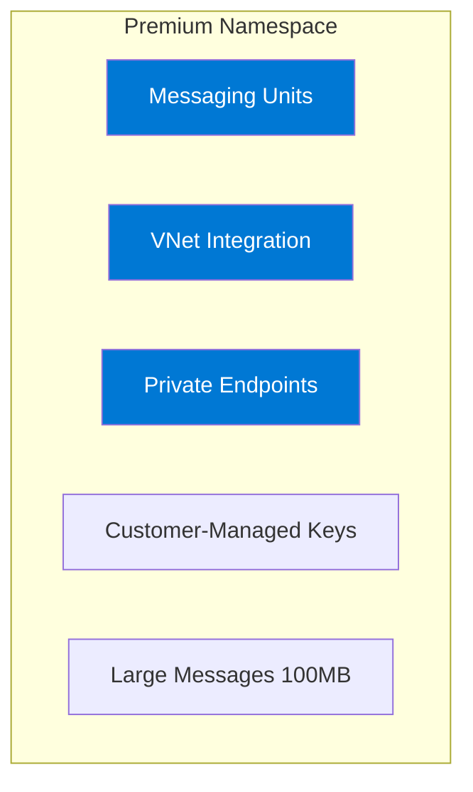

## Receive Modes

### Receive and Delete

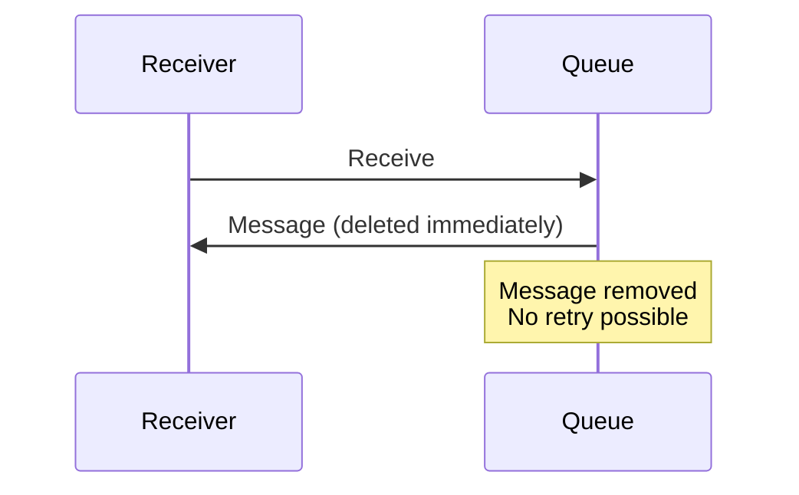

### Peek Lock (Recommended)

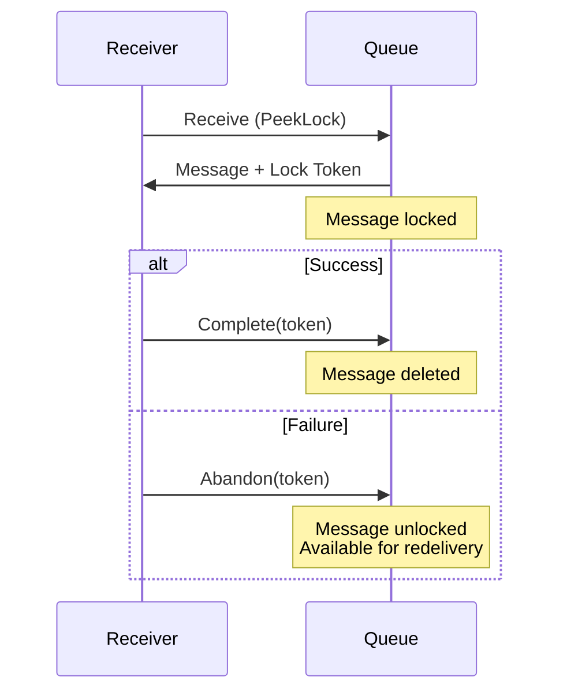

## Security

### Authentication Options

| Method | Description | Use Case |
|--------|-------------|----------|
| **Managed Identity** | Azure AD identity | Azure resources |
| **SAS Token** | Shared Access Signature | Specific permissions |
| **Azure AD** | Role-based access | Enterprise security |
| **Connection String** | Namespace-level access | Development |

### Built-in RBAC Roles

| Role | Permissions |
|------|-------------|
| **Owner** | Full access including IAM |
| **Data Owner** | Full data access |
| **Data Sender** | Send messages only |
| **Data Receiver** | Receive messages only |

### Network Security

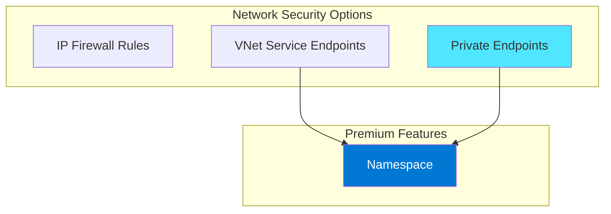

## Integration Patterns

### Pattern: Load Leveling

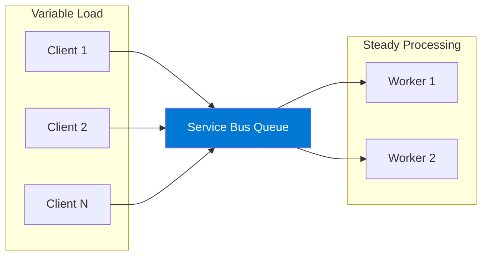

### Pattern: Competing Consumers

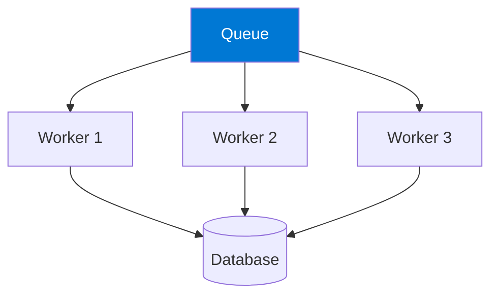

### Pattern: Event Distribution

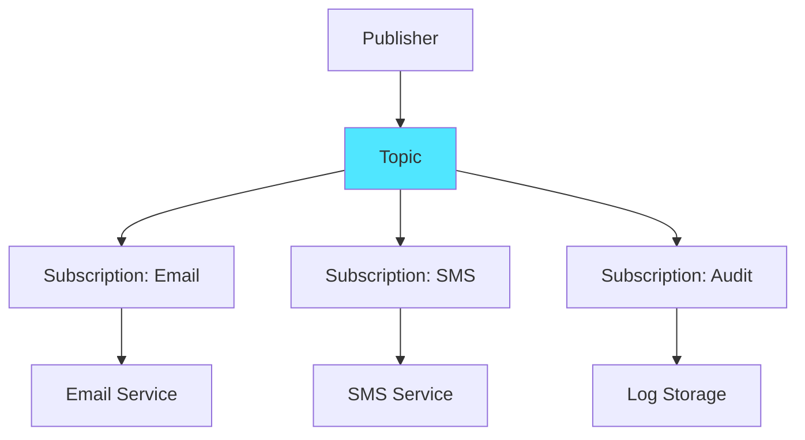

## Code Examples

### Sending Messages (C#)

```csharp
using Azure.Messaging.ServiceBus;

await using var client = new ServiceBusClient(connectionString);
await using var sender = client.CreateSender("my-queue");

// Send single message
var message = new ServiceBusMessage("Hello, Service Bus!");
message.ApplicationProperties["Priority"] = "High";
await sender.SendMessageAsync(message);

// Send batch
var batch = await sender.CreateMessageBatchAsync();
batch.TryAddMessage(new ServiceBusMessage("Message 1"));
batch.TryAddMessage(new ServiceBusMessage("Message 2"));
await sender.SendMessagesAsync(batch);
```

### Receiving Messages (C#)

```csharp
await using var client = new ServiceBusClient(connectionString);
await using var processor = client.CreateProcessor("my-queue", new ServiceBusProcessorOptions());

processor.ProcessMessageAsync += async args =>
{
    var body = args.Message.Body.ToString();
    Console.WriteLine($"Received: {body}");
    
    // Complete the message
    await args.CompleteMessageAsync(args.Message);
};

processor.ProcessErrorAsync += args =>
{
    Console.WriteLine($"Error: {args.Exception}");
    return Task.CompletedTask;
};

await processor.StartProcessingAsync();
```

## Best Practices

### Design

| Practice | Description |
|----------|-------------|
| **Use sessions for FIFO** | When order matters |
| **Enable duplicate detection** | For at-most-once delivery |
| **Set appropriate TTL** | Prevent queue buildup |
| **Use correlation IDs** | For request tracking |
| **Design for idempotency** | Handle redelivery |

### Performance

| Practice | Description |
|----------|-------------|
| **Use batching** | Group sends/receives |
| **Use prefetch** | Reduce round trips |
| **Choose Premium** | For consistent latency |
| **Use AMQP** | Better throughput than HTTP |
| **Connection pooling** | Reuse clients |

### Operations

| Practice | Description |
|----------|-------------|
| **Monitor DLQ** | Alert on dead letters |
| **Set up alerts** | Track queue depth |
| **Use Geo-DR** | For disaster recovery |
| **Auto-forward** | Simplify routing |

## Monitoring

### Key Metrics

| Metric | Description | Alert Threshold |
|--------|-------------|-----------------|
| **Active Messages** | Pending messages | Based on capacity |
| **Dead-lettered Messages** | Failed messages | > 0 |
| **Incoming Messages** | Rate of arrival | Baseline |
| **Outgoing Messages** | Rate of processing | Baseline |
| **Server Errors** | Backend failures | > 0 |

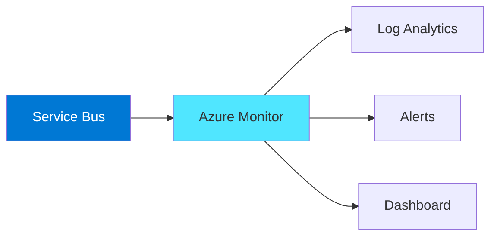

## Hands-On Lab Ideas

1. **Create queue and send/receive** - Basic messaging
2. **Implement pub-sub** - Topics and subscriptions
3. **Build retry pattern** - DLQ handling
4. **Session-based ordering** - FIFO processing
5. **Subscription filtering** - Message routing

---

## References

- [Azure Service Bus Documentation](https://learn.microsoft.com/en-us/azure/service-bus-messaging/)
- [Service Bus Messaging Overview](https://learn.microsoft.com/en-us/azure/service-bus-messaging/service-bus-messaging-overview)
- [Queues, Topics, and Subscriptions](https://learn.microsoft.com/en-us/azure/service-bus-messaging/service-bus-queues-topics-subscriptions)
- [Service Bus Premium Tier](https://learn.microsoft.com/en-us/azure/service-bus-messaging/service-bus-premium-messaging)
- [Service Bus .NET SDK](https://learn.microsoft.com/en-us/azure/service-bus-messaging/service-bus-dotnet-get-started-with-queues)
- [Best Practices](https://learn.microsoft.com/en-us/azure/service-bus-messaging/service-bus-performance-improvements)
- [Message Sessions](https://learn.microsoft.com/en-us/azure/service-bus-messaging/message-sessions)
