# Azure Event Grid

## Overview

Azure Event Grid is a highly scalable, fully managed event routing service that enables event-driven architectures using a publish-subscribe model. It simplifies event consumption and lowers costs by eliminating the need for constant polling, providing reliable delivery with retry and dead-letter capabilities.

Event Grid connects event sources to event handlers, allowing you to build reactive applications that respond to state changes across Azure services, custom applications, and partner solutions.

## Core Concepts

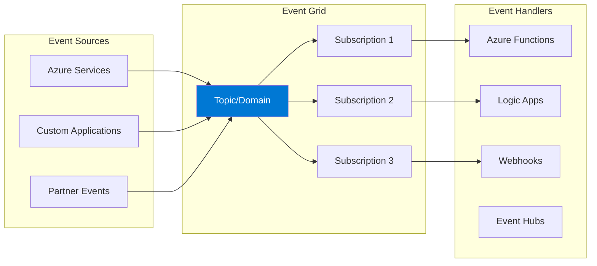

### Key Components

| Component | Description |
|-----------|-------------|
| **Event** | What happened (smallest unit of information) |
| **Event Source** | Where the event originated |
| **Topic** | Endpoint for receiving events |
| **Subscription** | Route events to handlers |
| **Event Handler** | Processes the event |

## Event Structure

### CloudEvents Schema (Recommended)

```json
{
    "specversion": "1.0",
    "type": "com.example.order.created",
    "source": "/mycontext/orders",
    "subject": "order/12345",
    "id": "A234-1234-1234",
    "time": "2024-01-15T12:00:00Z",
    "datacontenttype": "application/json",
    "data": {
        "orderId": "12345",
        "customerId": "C-100",
        "total": 150.00
    }
}
```

### Event Grid Schema

```json
{
    "id": "unique-event-id",
    "topic": "/subscriptions/{id}/resourceGroups/{rg}/...",
    "subject": "orders/12345",
    "eventType": "Order.Created",
    "eventTime": "2024-01-15T12:00:00Z",
    "data": {
        "orderId": "12345",
        "status": "new"
    },
    "dataVersion": "1.0"
}
```

## Topic Types

### System Topics (Azure Services)

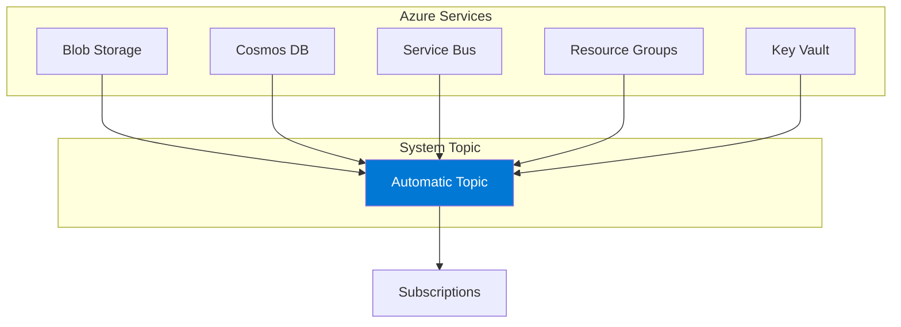

**Supported Azure Event Sources:**
- Storage (Blob, Files, Data Lake)
- Container Registry
- Event Hubs
- IoT Hub
- Key Vault
- Azure Maps
- Media Services
- Resource Groups
- Service Bus
- App Configuration
- Communication Services
- Machine Learning
- And many more...

### Custom Topics

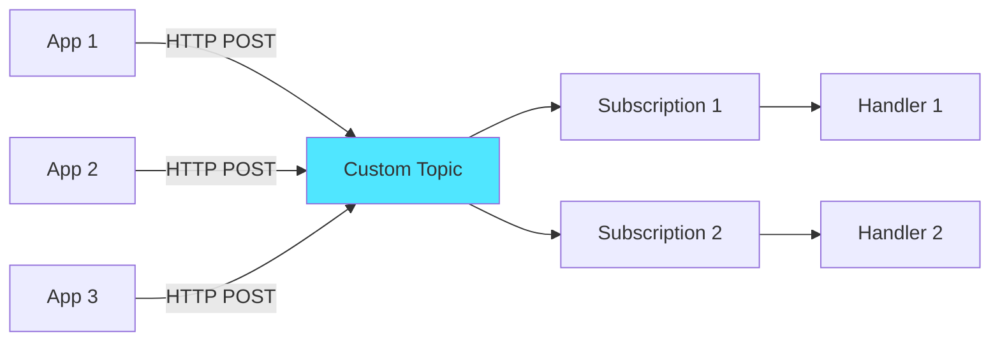

### Domain Topics

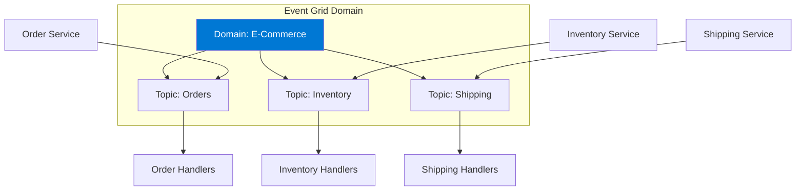

**Domain Benefits:**
- Up to 100,000 topics per domain
- Single endpoint for all topics
- Centralized access control
- Organized event management

### Partner Topics

Pre-integrated SaaS partner events:
- Auth0
- Microsoft Graph
- SAP
- Twilio

## Event Handlers

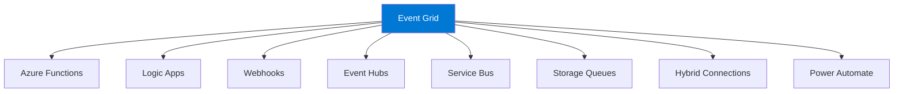

### Handler Comparison

| Handler | Latency | Use Case |
|---------|---------|----------|
| **Azure Functions** | Low | Serverless processing |
| **Logic Apps** | Medium | Workflow orchestration |
| **Webhooks** | Low | Custom applications |
| **Event Hubs** | Low | Stream processing |
| **Service Bus** | Low | Queue-based processing |
| **Storage Queues** | Medium | Simple queuing |

## Delivery Modes

### Push Delivery (Default)

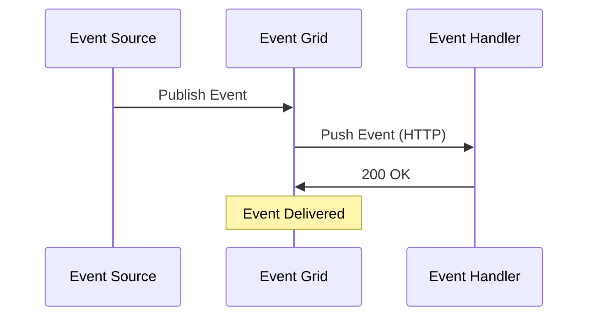

### Pull Delivery (Namespaces)

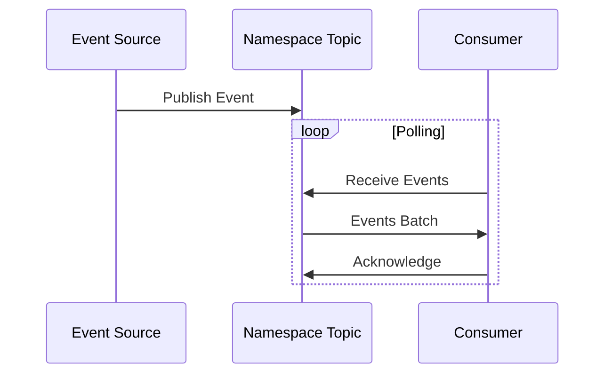

**Pull Delivery Benefits:**
- Consumer controls rate
- Batch processing
- Better for high-volume scenarios
- CloudEvents support

## Event Grid Namespaces

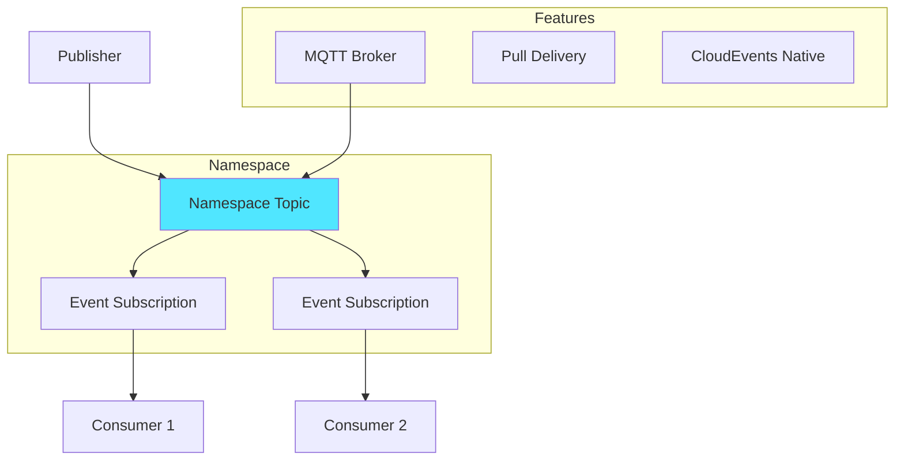

### MQTT Support
- IoT device communication
- Publish/subscribe over MQTT
- QoS 0 and 1 support
- Topic spaces for routing

## Filtering

### Event Type Filtering

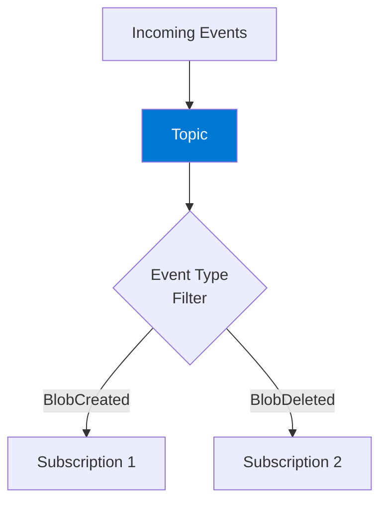

```json
{
    "filter": {
        "includedEventTypes": [
            "Microsoft.Storage.BlobCreated",
            "Microsoft.Storage.BlobDeleted"
        ]
    }
}
```

### Subject Filtering

```json
{
    "filter": {
        "subjectBeginsWith": "/blobServices/default/containers/orders",
        "subjectEndsWith": ".json"
    }
}
```

### Advanced Filtering

```json
{
    "filter": {
        "advancedFilters": [
            {
                "operatorType": "NumberGreaterThan",
                "key": "data.amount",
                "value": 1000
            },
            {
                "operatorType": "StringContains",
                "key": "data.region",
                "values": ["US", "EU"]
            },
            {
                "operatorType": "IsNotNull",
                "key": "data.customerId"
            }
        ]
    }
}
```

### Filter Operators

| Operator | Description |
|----------|-------------|
| **NumberIn/NumberNotIn** | Value in/not in list |
| **NumberGreaterThan** | Value comparison |
| **NumberLessThan** | Value comparison |
| **BoolEquals** | Boolean check |
| **StringContains** | Text contains |
| **StringBeginsWith** | Text prefix |
| **StringEndsWith** | Text suffix |
| **IsNullOrUndefined** | Null check |
| **IsNotNull** | Not null check |

## Reliability Features

### Retry Policy

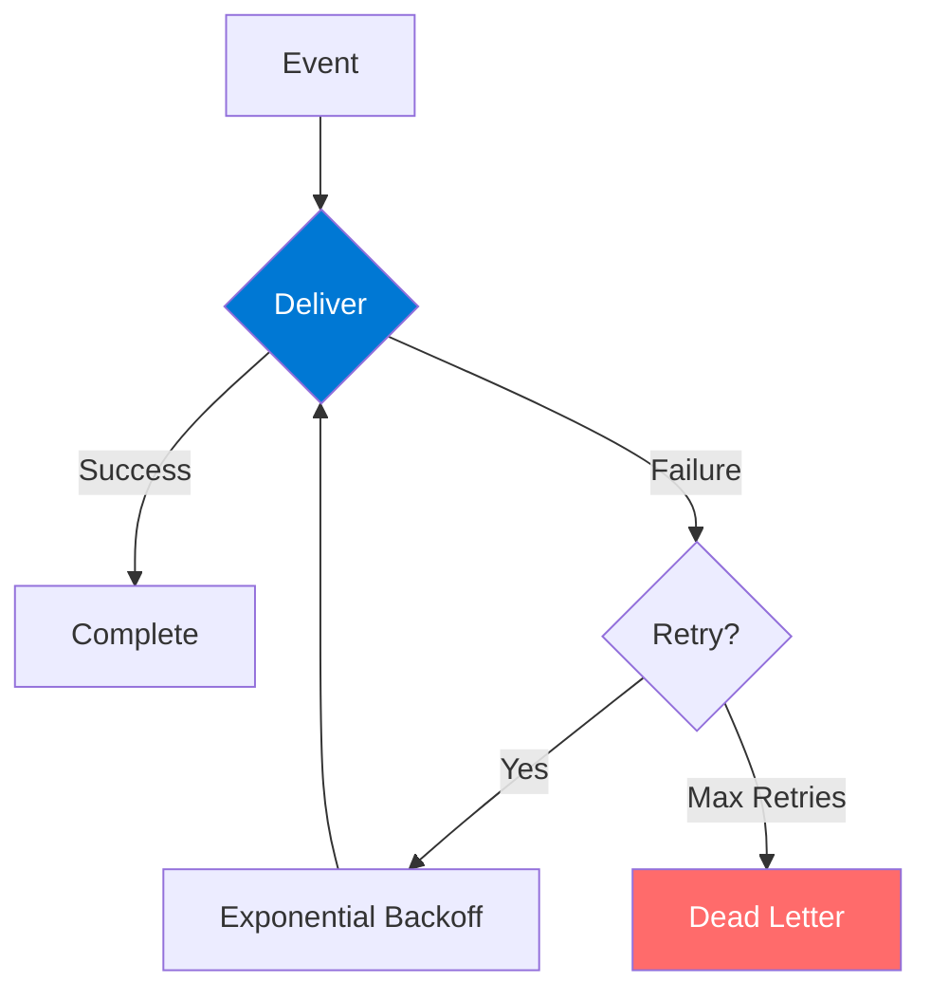

**Retry Configuration:**
- Maximum retry attempts (1-30)
- Event time-to-live (1 minute - 24 hours)
- Exponential backoff

### Dead-Letter Destination

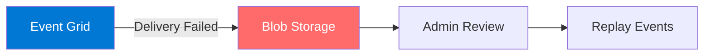

```json
{
    "deadLetterDestination": {
        "endpointType": "StorageBlob",
        "properties": {
            "resourceId": "/subscriptions/.../storageAccounts/mystorage",
            "blobContainerName": "deadletters"
        }
    }
}
```

### Batching

```json
{
    "deliveryPolicy": {
        "maxEventsPerBatch": 50,
        "preferredBatchSizeInKilobytes": 64
    }
}
```

## Security

### Authentication

| Method | Description | Use Case |
|--------|-------------|----------|
| **Webhook Validation** | Validation handshake | Custom endpoints |
| **Azure AD** | OAuth token | Enterprise apps |
| **SAS Token** | Shared access | Publishing events |
| **Managed Identity** | Azure identity | Azure services |

### Webhook Validation

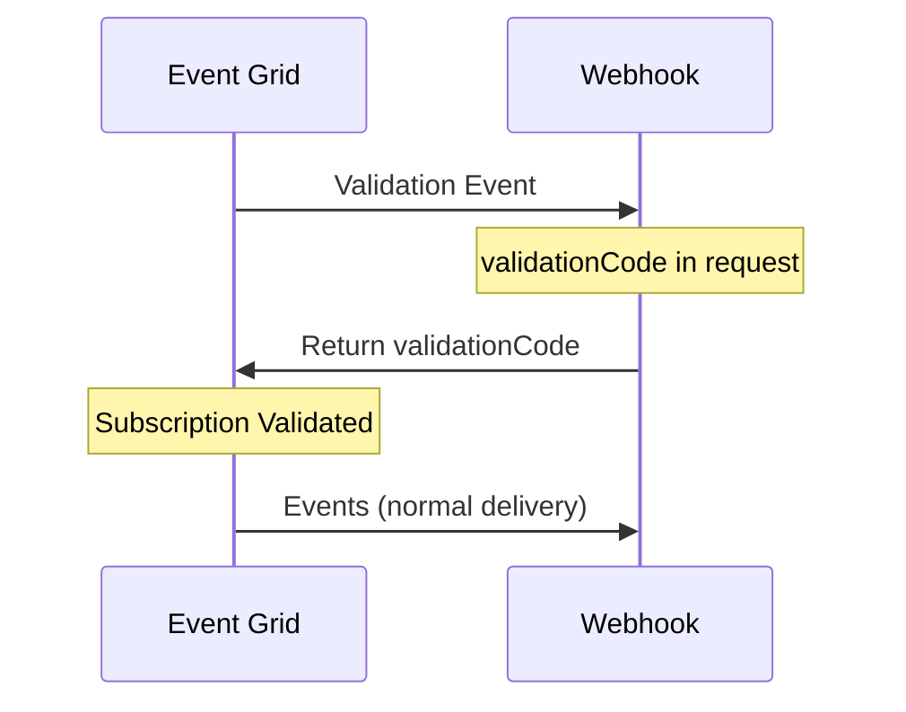

### Network Security

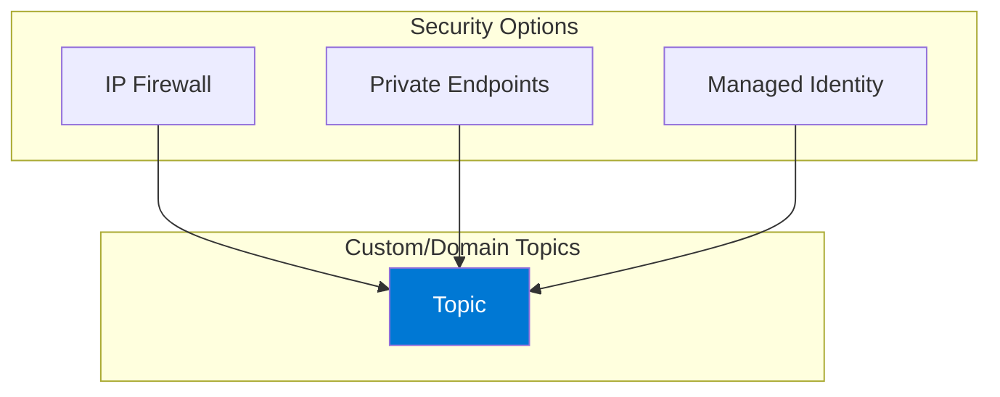

## Architecture Patterns

### Pattern 1: Event-Driven Microservices

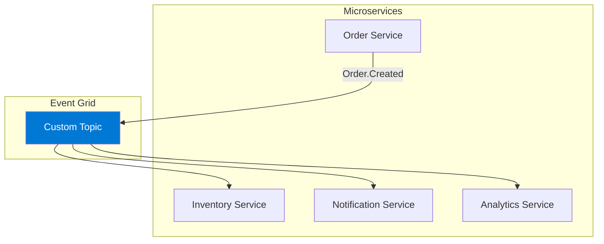

### Pattern 2: Multi-System Integration

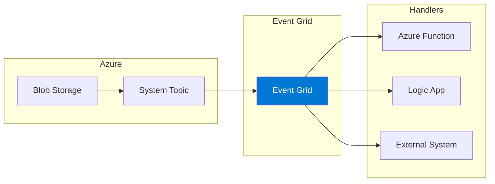

### Pattern 3: Fan-Out Processing

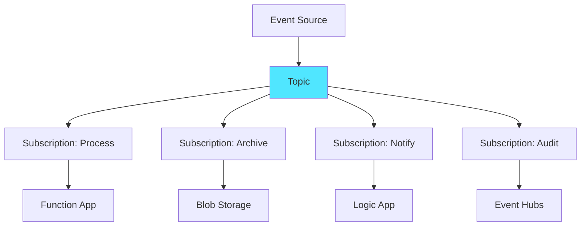

### Pattern 4: Azure Resource Events

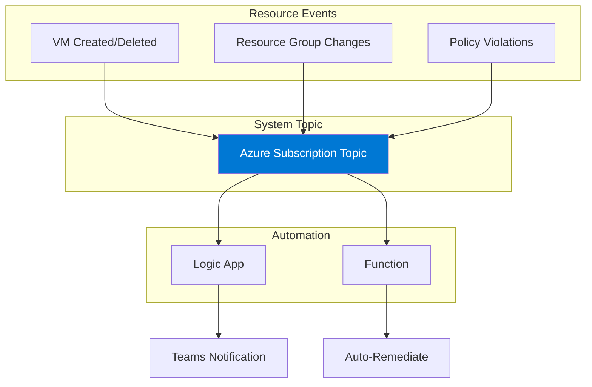

## Code Examples

### Publishing Events (C#)

```csharp
using Azure.Messaging.EventGrid;

var client = new EventGridPublisherClient(
    new Uri("https://mytopic.region.eventgrid.azure.net/api/events"),
    new AzureKeyCredential("your-key")
);

// Publish Event Grid format
var events = new List<EventGridEvent>
{
    new EventGridEvent(
        subject: "orders/12345",
        eventType: "Order.Created",
        dataVersion: "1.0",
        data: new { OrderId = "12345", Amount = 150.00 }
    )
};

await client.SendEventsAsync(events);

// Publish CloudEvents format
var cloudEvent = new CloudEvent(
    source: "/orders",
    type: "com.mycompany.order.created",
    jsonSerializableData: new { OrderId = "12345" }
);

await client.SendEventAsync(cloudEvent);
```

### Azure Function Handler

```csharp
[Function("ProcessOrderEvent")]
public async Task Run(
    [EventGridTrigger] CloudEvent cloudEvent,
    FunctionContext context)
{
    var logger = context.GetLogger("ProcessOrderEvent");
    
    var orderData = cloudEvent.Data.ToObjectFromJson<OrderData>();
    logger.LogInformation($"Processing order: {orderData.OrderId}");
    
    // Process the event
    await ProcessOrder(orderData);
}
```

## Monitoring

### Key Metrics

| Metric | Description |
|--------|-------------|
| **Publish Success Count** | Events successfully published |
| **Publish Failed Count** | Failed publish attempts |
| **Delivery Success Count** | Events delivered |
| **Delivery Failed Count** | Failed deliveries |
| **Matched Events** | Events matching filters |
| **Dead Lettered Events** | Events sent to DLQ |

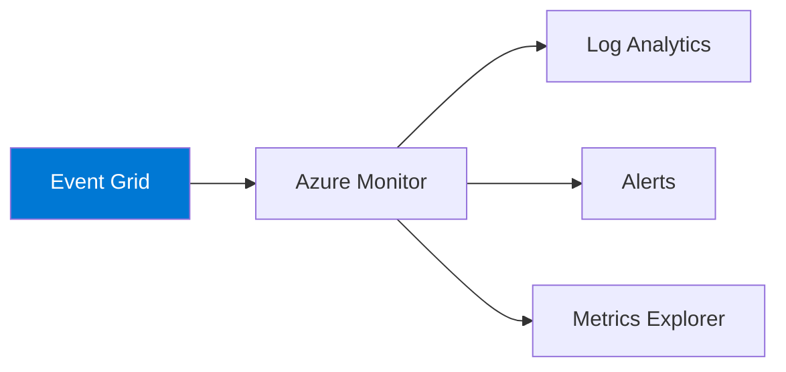

## Best Practices

### Design

| Practice | Description |
|----------|-------------|
| **Use CloudEvents** | Standard, portable schema |
| **Design idempotent handlers** | Handle duplicate events |
| **Keep events small** | Store details elsewhere |
| **Use domains** | For large applications |
| **Version event types** | For evolution |

### Performance

| Practice | Description |
|----------|-------------|
| **Use batching** | Reduce HTTP overhead |
| **Enable dead-lettering** | Don't lose events |
| **Set appropriate TTL** | Based on requirements |
| **Use namespaces** | For high-volume pull |

### Operations

| Practice | Description |
|----------|-------------|
| **Monitor delivery rates** | Track success/failure |
| **Alert on dead letters** | Investigate failures |
| **Use diagnostic logs** | For troubleshooting |
| **Test with Event Viewer** | Debug subscriptions |

## Events vs Messages

| Aspect | Event Grid (Events) | Service Bus (Messages) |
|--------|---------------------|------------------------|
| **Purpose** | Notification of state change | Work to be done |
| **Coupling** | Loose | Can be tighter |
| **Consumer** | Multiple (pub-sub) | Single (point-to-point) |
| **Content** | What happened | Instructions/data |
| **Response** | Optional | Often expected |
| **Retention** | Short-term | Configurable |

## Hands-On Lab Ideas

1. **React to blob storage events** - File processing pipeline
2. **Custom topic with filtering** - Multi-subscriber routing
3. **Resource group monitoring** - Governance automation
4. **Event Grid domain** - Multi-tenant application
5. **MQTT with namespaces** - IoT device integration

---

## References

- [Azure Event Grid Documentation](https://learn.microsoft.com/en-us/azure/event-grid/)
- [Event Grid Overview](https://learn.microsoft.com/en-us/azure/event-grid/overview)
- [System Topics](https://learn.microsoft.com/en-us/azure/event-grid/system-topics)
- [Custom Topics](https://learn.microsoft.com/en-us/azure/event-grid/custom-topics)
- [Event Handlers](https://learn.microsoft.com/en-us/azure/event-grid/event-handlers)
- [Event Filtering](https://learn.microsoft.com/en-us/azure/event-grid/event-filtering)
- [CloudEvents Schema](https://learn.microsoft.com/en-us/azure/event-grid/cloud-event-schema)
- [Event Grid Namespaces](https://learn.microsoft.com/en-us/azure/event-grid/concepts-event-grid-namespaces)
