# Azure Functions

## Overview

Azure Functions is an event-driven, serverless compute platform that enables you to run code on-demand without having to explicitly provision or manage infrastructure. It supports multiple programming languages and provides a rich ecosystem of triggers and bindings to integrate with various Azure services and external systems.

Functions excels at handling discrete events, processing data, integrating systems, working with IoT, and building simple APIs and microservices.

## Core Concepts

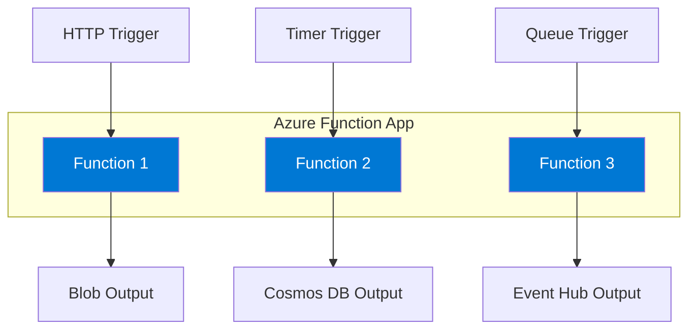

### Execution Model

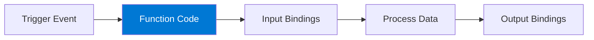

## Hosting Plans

### Plan Comparison

| Feature | Consumption | Flex Consumption | Premium | Dedicated |
|---------|-------------|------------------|---------|-----------|
| **Scaling** | Automatic | Fast auto-scale | Pre-warmed | Manual/auto |
| **Scale to zero** | ✓ | ✓ | ✗ | ✗ |
| **Cold start** | Yes | Minimal | No | No |
| **Max timeout** | 10 min | Configurable | Unlimited | Unlimited |
| **VNet support** | ✗ | ✓ | ✓ | ✓ |
| **Instance memory** | 1.5 GB | 2-4 GB | 3.5-14 GB | Varies |
| **Pricing** | Per execution | Per execution | Per instance | Per instance |

### Consumption Plan

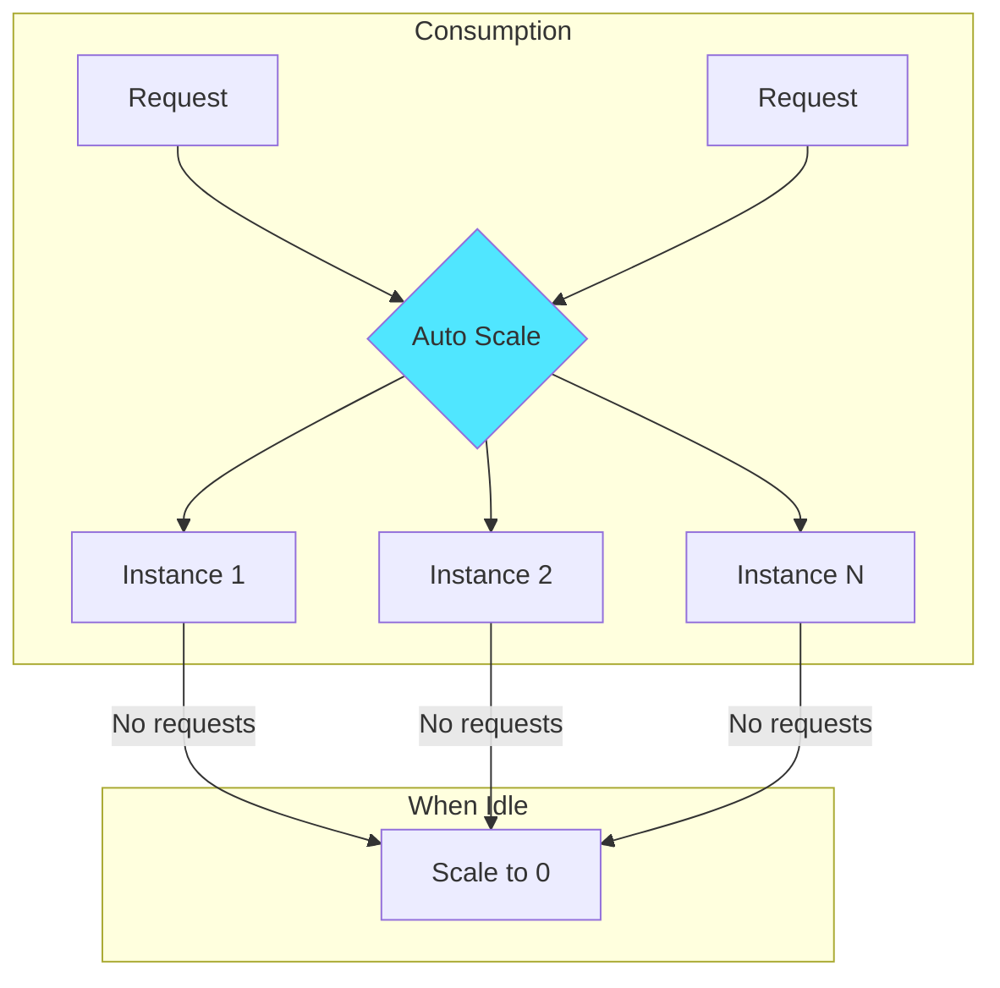

**Best For:**
- Intermittent workloads
- Development/testing
- Cost optimization
- Simple event processing

### Flex Consumption Plan

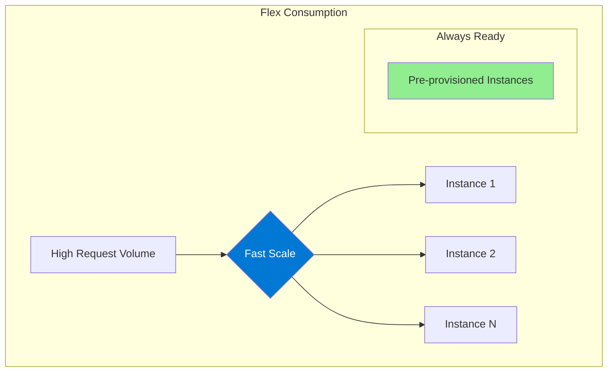

**Key Features:**
- Fast, event-driven scaling
- Private networking support
- Larger instance sizes (2-4 GB)
- Always-ready instance options
- Per-second billing

### Premium Plan

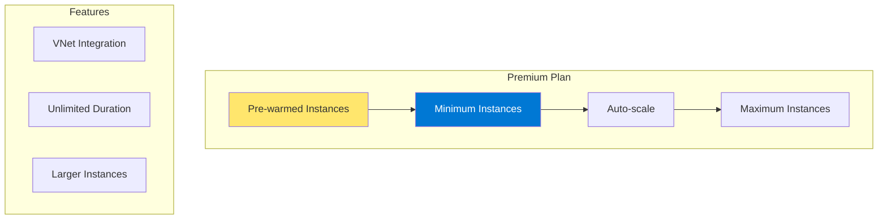

**Best For:**
- Enterprise workloads
- Low-latency requirements
- Long-running functions
- VNet connectivity needs

### Dedicated (App Service) Plan

**Best For:**
- Existing App Service plans
- Custom image requirements
- Predictable scaling
- Always-on applications

## Triggers and Bindings

### Trigger Types

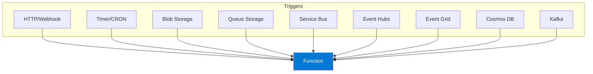

### Common Triggers

| Trigger | Use Case | Event Type |
|---------|----------|------------|
| **HTTP** | APIs, webhooks | Request/response |
| **Timer** | Scheduled jobs | CRON expression |
| **Blob Storage** | File processing | Blob created/updated |
| **Queue Storage** | Work queue | Message received |
| **Service Bus** | Enterprise messaging | Queue/topic message |
| **Event Hubs** | Streaming data | Event stream |
| **Event Grid** | Event reactions | Azure events |
| **Cosmos DB** | Change feed | Document change |

### Input/Output Bindings

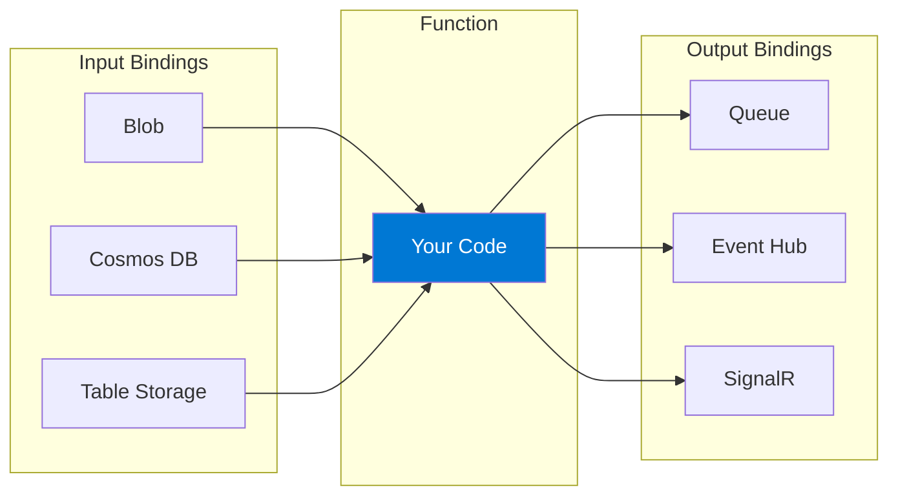

## Code Examples

### HTTP Trigger (C#)

```csharp
[Function("HttpExample")]
public IActionResult Run(
    [HttpTrigger(AuthorizationLevel.Function, "get", "post")] HttpRequest req,
    FunctionContext context)
{
    var logger = context.GetLogger("HttpExample");
    logger.LogInformation("C# HTTP trigger function processed a request.");

    string name = req.Query["name"];
    
    return new OkObjectResult($"Hello, {name}!");
}
```

### Timer Trigger

```csharp
[Function("TimerExample")]
public void Run(
    [TimerTrigger("0 */5 * * * *")] TimerInfo timer,
    FunctionContext context)
{
    var logger = context.GetLogger("TimerExample");
    logger.LogInformation($"Timer trigger executed at: {DateTime.Now}");
    
    if (timer.ScheduleStatus?.Last != null)
    {
        logger.LogInformation($"Last run: {timer.ScheduleStatus.Last}");
    }
}
```

### Queue Trigger with Output Binding

```csharp
[Function("ProcessOrder")]
[BlobOutput("processed/{id}.json")]
public OrderResult Run(
    [QueueTrigger("orders")] Order order,
    [BlobInput("templates/receipt.html")] string template,
    FunctionContext context)
{
    var logger = context.GetLogger("ProcessOrder");
    logger.LogInformation($"Processing order: {order.Id}");
    
    // Process and return result (automatically saved to blob)
    return new OrderResult 
    { 
        OrderId = order.Id, 
        Status = "Processed",
        Timestamp = DateTime.UtcNow 
    };
}
```

### Service Bus Trigger

```csharp
[Function("ProcessMessage")]
public async Task Run(
    [ServiceBusTrigger("myqueue", Connection = "ServiceBusConnection")] 
    ServiceBusReceivedMessage message,
    [CosmosDBOutput("database", "container", Connection = "CosmosDB")] 
    IAsyncCollector<dynamic> documents,
    FunctionContext context)
{
    var logger = context.GetLogger("ProcessMessage");
    var body = message.Body.ToString();
    
    await documents.AddAsync(new { 
        id = message.MessageId,
        content = body,
        processedAt = DateTime.UtcNow
    });
}
```

### Event Grid Trigger

```csharp
[Function("ProcessBlobEvent")]
public void Run(
    [EventGridTrigger] CloudEvent cloudEvent,
    FunctionContext context)
{
    var logger = context.GetLogger("ProcessBlobEvent");
    
    logger.LogInformation($"Event Type: {cloudEvent.Type}");
    logger.LogInformation($"Subject: {cloudEvent.Subject}");
    
    var data = cloudEvent.Data.ToObjectFromJson<StorageBlobCreatedEventData>();
    logger.LogInformation($"Blob URL: {data.Url}");
}
```

## Durable Functions

Durable Functions enable stateful workflows in serverless applications.

### Orchestration Patterns

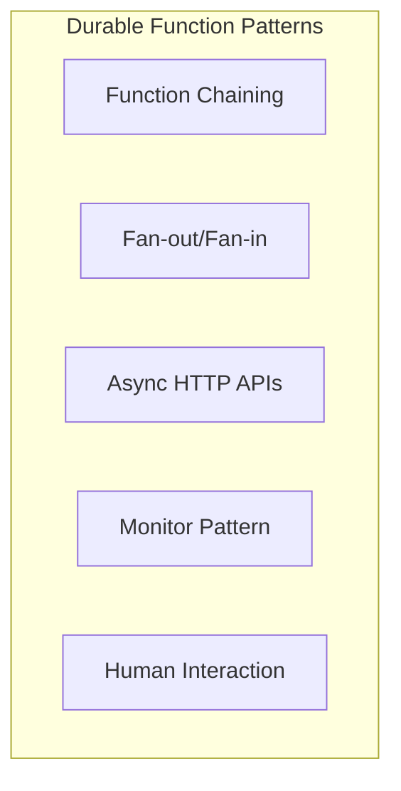

### Function Chaining

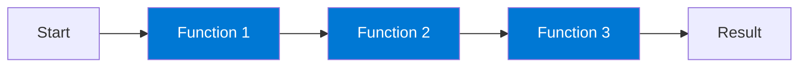

```csharp
[Function("ChainOrchestrator")]
public static async Task<string> RunOrchestrator(
    [OrchestrationTrigger] TaskOrchestrationContext context)
{
    var result1 = await context.CallActivityAsync<string>("Step1", null);
    var result2 = await context.CallActivityAsync<string>("Step2", result1);
    var result3 = await context.CallActivityAsync<string>("Step3", result2);
    
    return result3;
}
```

### Fan-Out/Fan-In

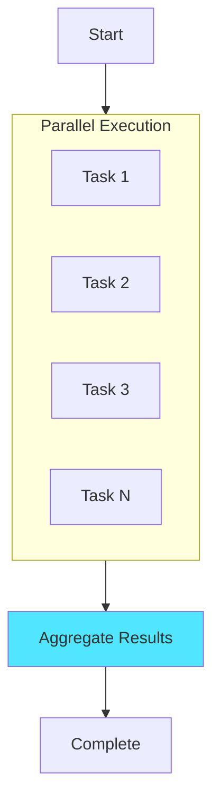

```csharp
[Function("FanOutOrchestrator")]
public static async Task<int[]> RunOrchestrator(
    [OrchestrationTrigger] TaskOrchestrationContext context)
{
    var items = await context.CallActivityAsync<string[]>("GetItems", null);
    
    var tasks = items.Select(item => 
        context.CallActivityAsync<int>("ProcessItem", item));
    
    var results = await Task.WhenAll(tasks);
    
    return results;
}
```

### Human Interaction (Approval)

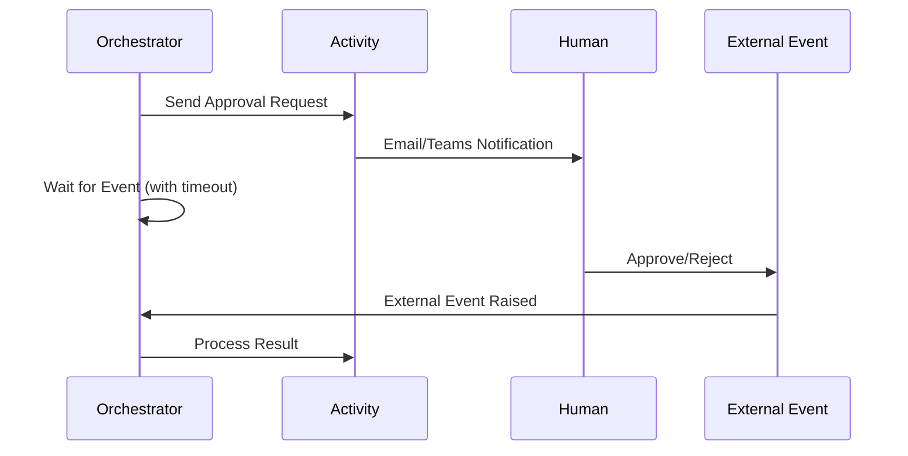

```csharp
[Function("ApprovalOrchestrator")]
public static async Task<bool> RunOrchestrator(
    [OrchestrationTrigger] TaskOrchestrationContext context)
{
    await context.CallActivityAsync("SendApprovalRequest", context.InstanceId);
    
    using var cts = new CancellationTokenSource();
    var timeout = context.CurrentUtcDateTime.AddDays(3);
    var timeoutTask = context.CreateTimer(timeout, cts.Token);
    
    var approvalTask = context.WaitForExternalEvent<bool>("ApprovalEvent");
    
    var winner = await Task.WhenAny(approvalTask, timeoutTask);
    
    if (winner == approvalTask)
    {
        cts.Cancel();
        return approvalTask.Result;
    }
    
    return false; // Timeout - not approved
}
```

## Security

### Authentication Levels

| Level | Description | Use Case |
|-------|-------------|----------|
| **Anonymous** | No authentication | Public APIs |
| **Function** | Function-specific key | Default for triggers |
| **Admin** | Master key only | Admin operations |

### Authentication Options

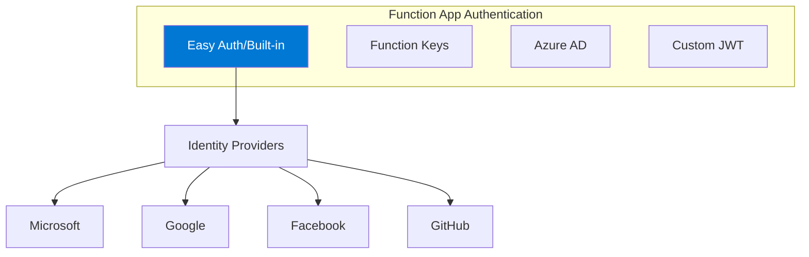

### Security Best Practices

| Practice | Description |
|----------|-------------|
| **Use Managed Identity** | For Azure resource access |
| **Store secrets in Key Vault** | Never in code/config |
| **Enable HTTPS only** | Secure transport |
| **Use Azure AD auth** | For enterprise scenarios |
| **Implement CORS properly** | For browser clients |
| **Enable VNet integration** | Network isolation |

## Monitoring and Diagnostics

### Application Insights Integration

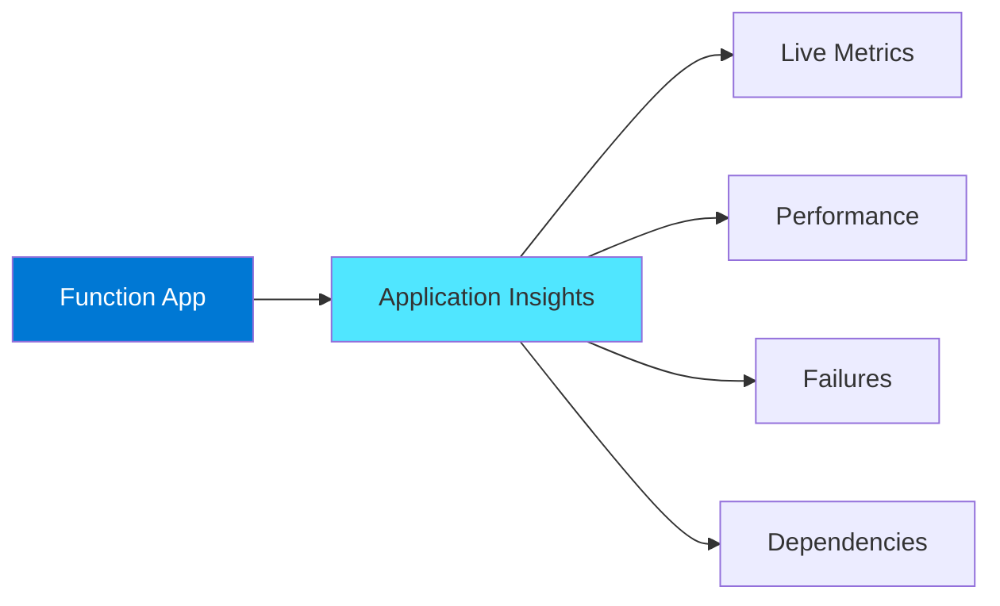

### Key Metrics

| Metric | Description |
|--------|-------------|
| **Function Execution Count** | Number of executions |
| **Function Execution Units** | Consumption billing |
| **Function Execution Time** | Duration |
| **Success/Failure Rate** | Reliability |
| **Memory Working Set** | Memory usage |
| **HTTP Response Time** | API latency |

### Custom Telemetry

```csharp
[Function("TrackedFunction")]
public IActionResult Run(
    [HttpTrigger(AuthorizationLevel.Function, "get")] HttpRequest req,
    FunctionContext context)
{
    var logger = context.GetLogger("TrackedFunction");
    
    // Custom metrics and events
    logger.LogInformation("Processing request {RequestId}", req.HttpContext.TraceIdentifier);
    
    using (logger.BeginScope(new Dictionary<string, object>
    {
        ["CustomProperty"] = "CustomValue"
    }))
    {
        // Your code here
    }
    
    return new OkResult();
}
```

## Deployment Options

### Deployment Methods

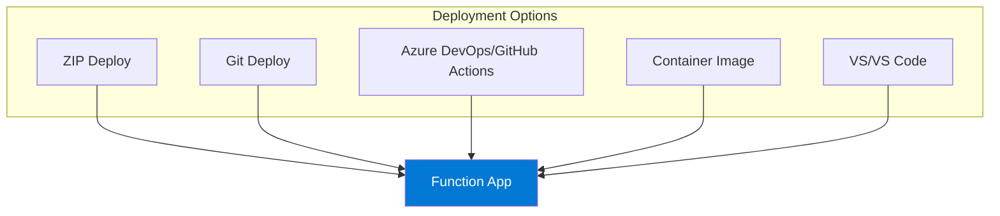

### Infrastructure as Code (Bicep)

```bicep
resource functionApp 'Microsoft.Web/sites@2022-03-01' = {
  name: 'myFunctionApp'
  location: location
  kind: 'functionapp'
  identity: {
    type: 'SystemAssigned'
  }
  properties: {
    serverFarmId: hostingPlan.id
    siteConfig: {
      appSettings: [
        {
          name: 'AzureWebJobsStorage'
          value: storageConnectionString
        }
        {
          name: 'FUNCTIONS_EXTENSION_VERSION'
          value: '~4'
        }
        {
          name: 'FUNCTIONS_WORKER_RUNTIME'
          value: 'dotnet-isolated'
        }
      ]
    }
  }
}
```

## Best Practices

### Design

| Practice | Description |
|----------|-------------|
| **Keep functions small** | Single responsibility |
| **Design for idempotency** | Handle retries |
| **Use async/await** | Non-blocking I/O |
| **Handle exceptions** | Proper error handling |
| **Use bindings** | Reduce boilerplate |

### Performance

| Practice | Description |
|----------|-------------|
| **Minimize cold starts** | Premium/Flex plans |
| **Connection pooling** | Reuse connections |
| **Batch operations** | Reduce round trips |
| **Use output bindings** | Efficient data write |
| **Profile and optimize** | Monitor execution time |

### Operations

| Practice | Description |
|----------|-------------|
| **Enable Application Insights** | Full observability |
| **Use slots** | Zero-downtime deployments |
| **Configure autoscale** | Handle load spikes |
| **Set retry policies** | Handle transient failures |

## Architecture Patterns

### Pattern: API Backend

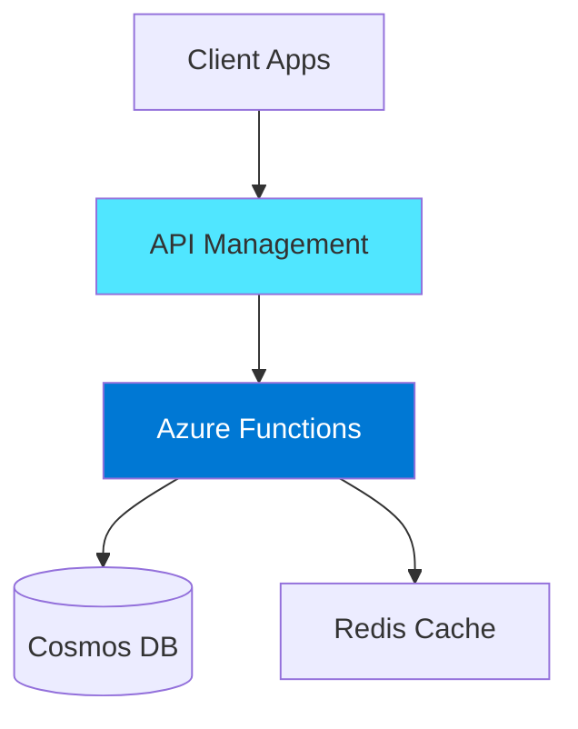

### Pattern: Event Processing

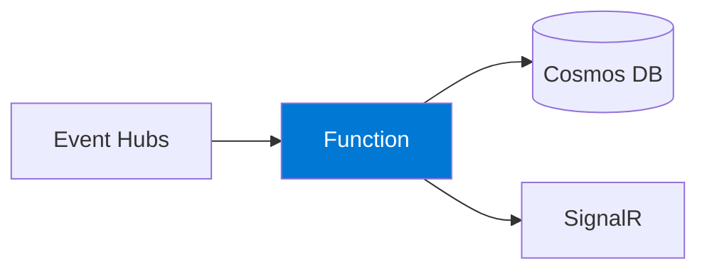

### Pattern: Scheduled Jobs

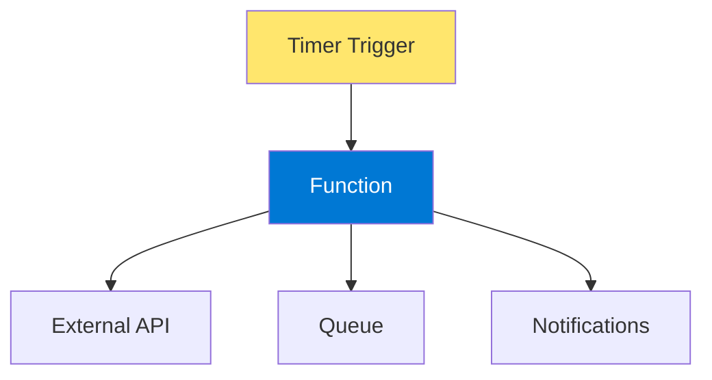

## Pricing Considerations

### Consumption Plan
- **Executions**: First 1M free, then per million
- **Execution Time**: GB-seconds
- **Memory**: Based on function memory usage

### Flex Consumption
- **On-demand**: Per-second compute billing
- **Always ready**: Pre-provisioned instances
- **Networking**: Additional for VNet

### Premium Plan
- **Base cost**: vCPU and memory per instance
- **Pre-warmed**: Minimum instance count
- **Scale**: Additional instances as needed

## Hands-On Lab Ideas

1. **Build HTTP API** - CRUD operations with Cosmos DB
2. **Scheduled data sync** - Timer trigger with external APIs
3. **Event processing** - Event Grid + Functions pipeline
4. **Durable workflow** - Order approval process
5. **Real-time dashboard** - Event Hubs + SignalR

---

## References

- [Azure Functions Documentation](https://learn.microsoft.com/en-us/azure/azure-functions/)
- [Functions Overview](https://learn.microsoft.com/en-us/azure/azure-functions/functions-overview)
- [Hosting Plans Comparison](https://learn.microsoft.com/en-us/azure/azure-functions/functions-scale)
- [Flex Consumption Plan](https://learn.microsoft.com/en-us/azure/azure-functions/flex-consumption-plan)
- [Triggers and Bindings](https://learn.microsoft.com/en-us/azure/azure-functions/functions-triggers-bindings)
- [Durable Functions](https://learn.microsoft.com/en-us/azure/azure-functions/durable/durable-functions-overview)
- [Best Practices](https://learn.microsoft.com/en-us/azure/azure-functions/functions-best-practices)
- [.NET Isolated Process](https://learn.microsoft.com/en-us/azure/azure-functions/dotnet-isolated-process-guide)
