# Azure Data Factory

## Overview

Azure Data Factory (ADF) is a cloud-based data integration service that allows you to create data-driven workflows (pipelines) for orchestrating and automating data movement and data transformation. It's the ETL/ELT service of choice in Azure for enterprise-scale data integration scenarios.

Data Factory enables you to ingest data from various sources, transform it at scale, and load it into data stores for analytics, reporting, and machine learning.

## Core Concepts

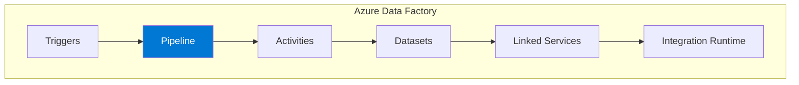

### Component Relationships

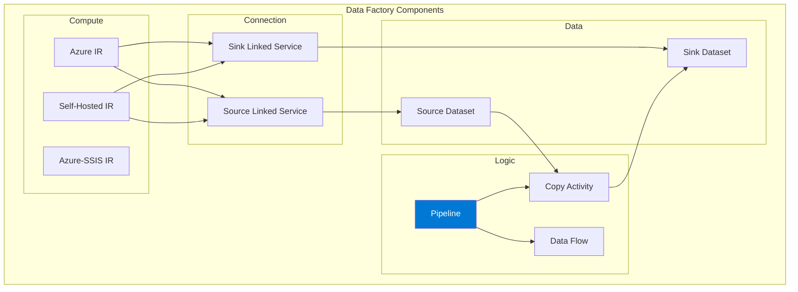

## Pipelines and Activities

### Pipeline Structure

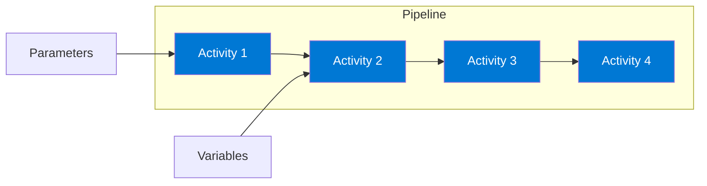

### Activity Types

| Category | Activities | Description |
|----------|------------|-------------|
| **Data Movement** | Copy | Move data between stores |
| **Data Transformation** | Data Flow, HDInsight, Databricks | Transform data at scale |
| **Control Flow** | If, ForEach, Switch, Until | Pipeline logic |
| **External** | Web, Azure Function, Logic App | Call external services |
| **Lookup** | Lookup, Get Metadata | Query data/metadata |
| **Iteration** | ForEach, Until | Loop constructs |

### Activity Dependencies

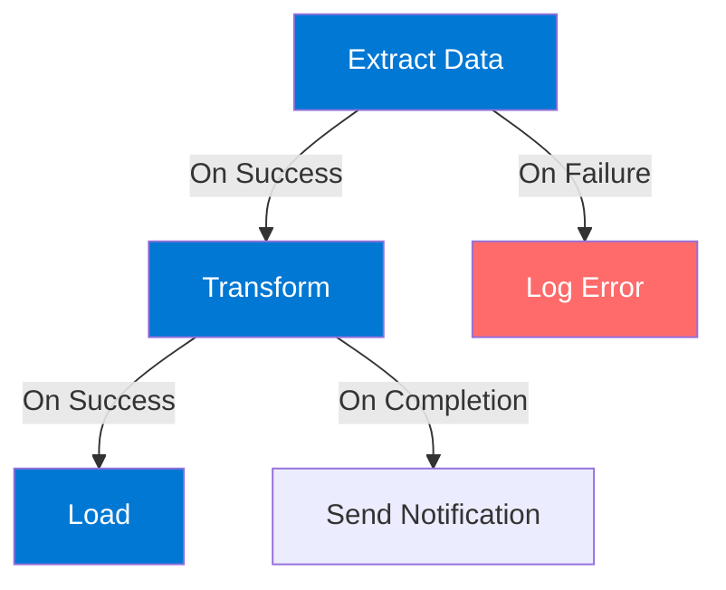

**Dependency Conditions:**
- **On Success** - Runs if previous succeeded
- **On Failure** - Runs if previous failed
- **On Completion** - Always runs
- **On Skipped** - Runs if previous was skipped

## Data Integration Patterns

### Pattern 1: ETL Pipeline

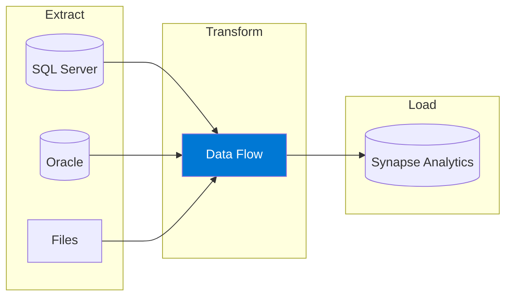

### Pattern 2: ELT Pipeline

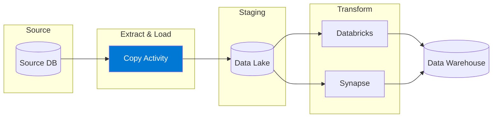

### Pattern 3: Incremental Load

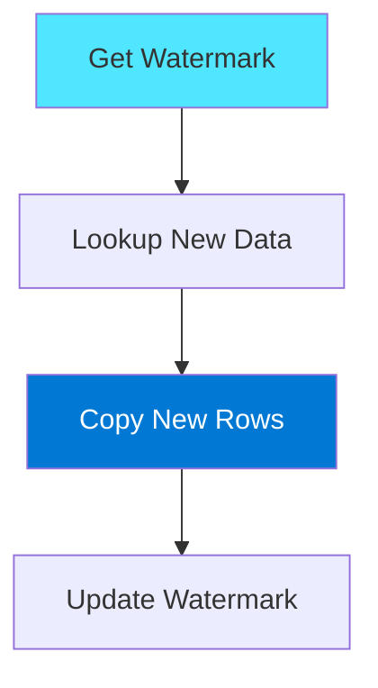

## Copy Activity

### Architecture

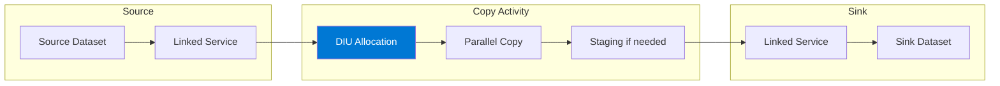

### Performance Tuning

| Setting | Description | Recommendation |
|---------|-------------|----------------|
| **Data Integration Units** | Parallel compute | Auto or 2-256 DIU |
| **Parallel Copy** | Concurrent operations | Based on source |
| **Staging** | Use blob for PolyBase | Enable for Synapse |
| **Source Partitions** | Physical partitions | Match source |

### Supported Connectors

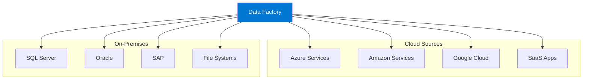

**90+ Connectors Including:**
- Azure (Blob, ADLS, SQL, Cosmos DB, Synapse)
- Databases (SQL Server, Oracle, MySQL, PostgreSQL)
- SaaS (Salesforce, Dynamics, SAP, ServiceNow)
- Files (Parquet, JSON, CSV, Avro, ORC)
- Big Data (Hadoop, Spark, Databricks)

## Data Flows

### Mapping Data Flows

Visual data transformation at scale using Spark.

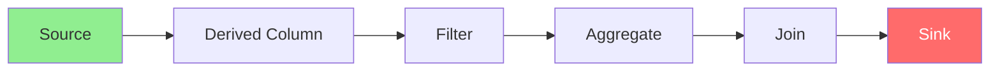

### Transformation Types

| Category | Transformations |
|----------|-----------------|
| **Schema Modifier** | Derived Column, Select, Cast |
| **Row Modifier** | Filter, Sort, Alter Row, Assert |
| **Multiple Inputs** | Join, Union, Lookup, Exists |
| **Multiple Outputs** | Conditional Split, New Branch |
| **Aggregators** | Aggregate, Window, Pivot, Unpivot |
| **Formatters** | Flatten, Parse, Stringify |

### Data Flow Example

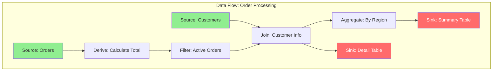

### Data Flow Performance

| Feature | Description |
|---------|-------------|
| **Core Count** | 8-256 cores per cluster |
| **TTL** | Cluster reuse time |
| **Partitioning** | Round robin, hash, dynamic |
| **Debug Cluster** | Interactive development |

## Integration Runtime

### Runtime Types

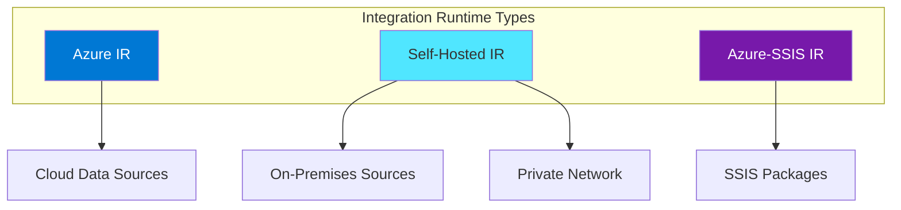

### Integration Runtime Comparison

| Feature | Azure IR | Self-Hosted IR | Azure-SSIS IR |
|---------|----------|----------------|---------------|
| **Location** | Azure regions | On-premises | Azure |
| **Use case** | Cloud to cloud | Hybrid | SSIS lift & shift |
| **Managed** | Fully managed | Customer managed | Managed |
| **Network** | Public | Private/hybrid | VNet |
| **Data Flow** | ✓ | ✗ | ✗ |

### Self-Hosted IR Architecture

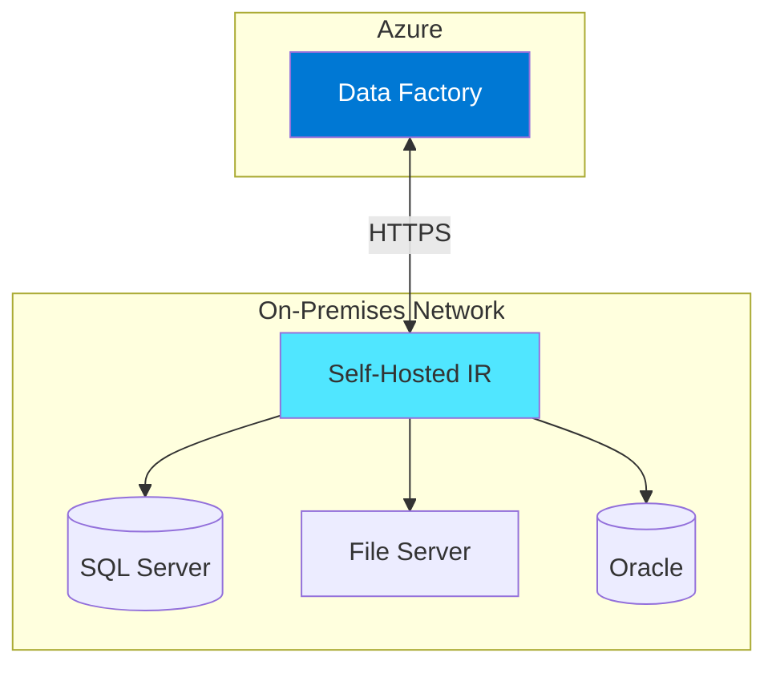

## Triggers

### Trigger Types

| Type | Description | Use Case |
|------|-------------|----------|
| **Schedule** | Time-based, cron | Regular ETL jobs |
| **Tumbling Window** | Fixed intervals | Time-series data |
| **Event** | Storage events | File-based processing |
| **Custom Event** | Event Grid | Event-driven |

### Schedule Trigger

```json
{
    "name": "DailyTrigger",
    "type": "ScheduleTrigger",
    "properties": {
        "recurrence": {
            "frequency": "Day",
            "interval": 1,
            "startTime": "2024-01-01T00:00:00Z",
            "timeZone": "UTC"
        },
        "pipelines": [
            {
                "pipelineReference": {
                    "type": "PipelineReference",
                    "referenceName": "DailyETL"
                }
            }
        ]
    }
}
```

### Tumbling Window Trigger

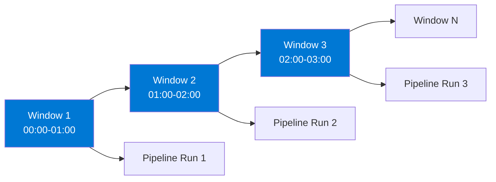

**Tumbling Window Features:**
- Retry on failure
- Dependency management
- Backfill historical data
- Concurrent execution control

### Event Trigger


## Control Flow

### ForEach Loop

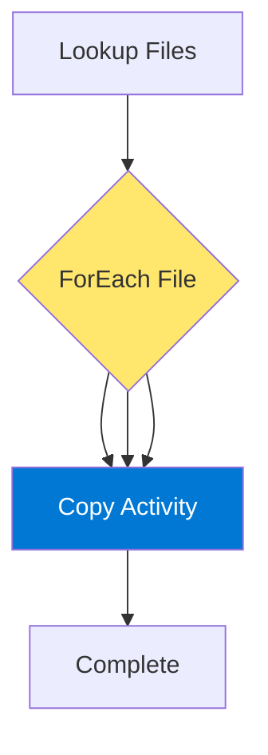

### If Condition

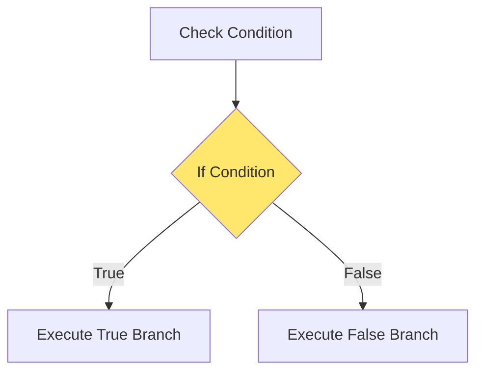

### Until Loop

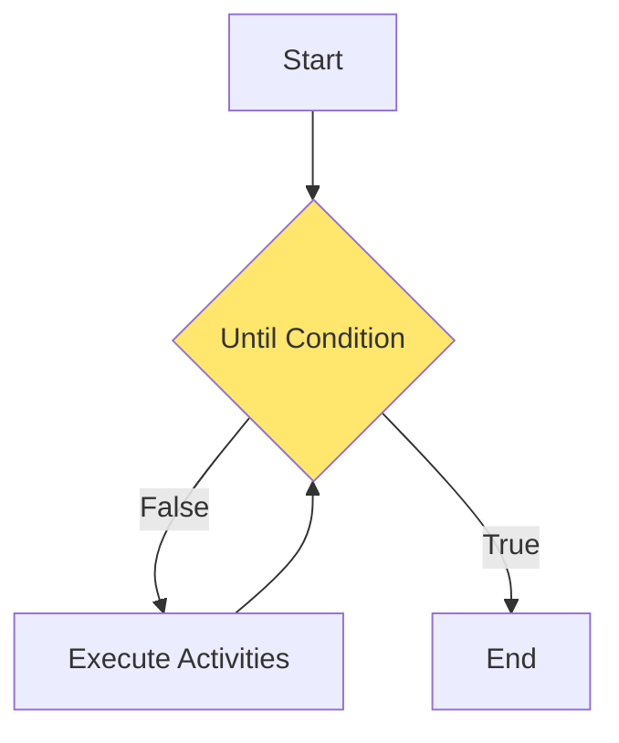

## Monitoring

### Monitor Dashboard

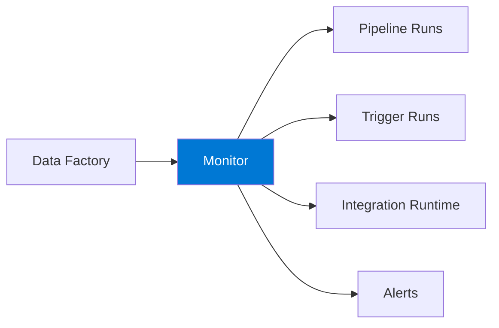

### Key Metrics

| Metric | Description |
|--------|-------------|
| **Pipeline runs** | Success/failure count |
| **Activity runs** | Per-activity status |
| **Trigger runs** | Trigger execution history |
| **IR utilization** | Resource usage |
| **Data flow metrics** | Spark execution details |

### Alerting

```json
{
    "alerts": [
        {
            "name": "PipelineFailure",
            "condition": "Pipeline run failed",
            "action": "Send email, Logic App, Function"
        },
        {
            "name": "LongRunning",
            "condition": "Duration > threshold",
            "action": "Send notification"
        }
    ]
}
```

## Security

### Authentication Methods

| Method | Use Case |
|--------|----------|
| **Managed Identity** | Azure resources |
| **Service Principal** | Cross-tenant |
| **SQL Authentication** | Database access |
| **Key Vault** | Secret management |
| **User-assigned MI** | Shared identity |

### Network Security

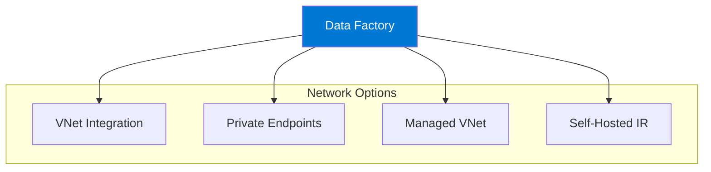

### Managed Virtual Network

```mermaid
flowchart TB
    subgraph "Managed VNet"
        AIR[Azure IR]
        PE1[Private Endpoint - SQL]
        PE2[Private Endpoint - Storage]
        PE3[Private Endpoint - Key Vault]
    end
    
    subgraph "Azure Resources"
        SQL[(Azure SQL)]
        BLOB[Blob Storage]
        KV[Key Vault]
    end
    
    AIR --> PE1 --> SQL
    AIR --> PE2 --> BLOB
    AIR --> PE3 --> KV
    
    style AIR fill:#0078D4,color:#fff
```

## CI/CD and DevOps

### Git Integration

```mermaid
flowchart LR
    DEV[Development] --> GIT[Git Repository]
    GIT --> COLLAB[Collaboration Branch]
    COLLAB --> PR[Pull Request]
    PR --> MAIN[Main Branch]
    MAIN --> RELEASE[Release Pipeline]
    RELEASE --> PROD[Production]
    
    style GIT fill:#0078D4,color:#fff
```

### Deployment Workflow

```mermaid
flowchart TB
    subgraph "Development"
        DEV_ADF[Dev Data Factory]
        DEV_GIT[Feature Branch]
    end
    
    subgraph "Build"
        ARM[ARM Templates]
        PARAM[Parameter Files]
    end
    
    subgraph "Release"
        TEST[Test Environment]
        PROD[Production]
    end
    
    DEV_ADF --> DEV_GIT --> ARM
    ARM --> TEST --> PROD
    PARAM --> TEST & PROD
    
    style ARM fill:#50E6FF
```

## Best Practices

### Design

| Practice | Description |
|----------|-------------|
| **Modular pipelines** | Reusable components |
| **Use parameters** | Environment flexibility |
| **Incremental loads** | Efficient processing |
| **Error handling** | Proper failure paths |
| **Naming conventions** | Consistent naming |

### Performance

| Practice | Description |
|----------|-------------|
| **Right-size DIUs** | Balance cost/performance |
| **Use staging** | For Synapse/PolyBase |
| **Partition data** | Parallel processing |
| **Optimize queries** | Source optimization |
| **Cache lookup results** | Reduce round trips |

### Operations

| Practice | Description |
|----------|-------------|
| **Enable Git** | Version control |
| **Monitor pipelines** | Proactive alerting |
| **Document pipelines** | Annotations |
| **Test thoroughly** | Debug before publish |

## Architecture Patterns

### Pattern: Data Lake Architecture

```mermaid
flowchart TB
    subgraph "Sources"
        SRC1[(Operational DB)]
        SRC2[Files]
        SRC3[APIs]
    end
    
    subgraph "Data Factory"
        ADF[Orchestration]
    end
    
    subgraph "Data Lake"
        RAW[Raw Zone]
        CURATED[Curated Zone]
        CONSUME[Consumption Zone]
    end
    
    subgraph "Analytics"
        SYN[Synapse]
        PBI[Power BI]
    end
    
    SRC1 & SRC2 & SRC3 --> ADF
    ADF --> RAW --> CURATED --> CONSUME
    CONSUME --> SYN --> PBI
    
    style ADF fill:#0078D4,color:#fff
```

### Pattern: Hybrid Integration

```mermaid
flowchart LR
    subgraph "On-Premises"
        ONPREM[(On-Prem SQL)]
        SHIR[Self-Hosted IR]
    end
    
    subgraph "Azure"
        ADF[Data Factory]
        ADLS[(Data Lake)]
        SYN[(Synapse)]
    end
    
    ONPREM --> SHIR --> ADF
    ADF --> ADLS --> SYN
    
    style ADF fill:#0078D4,color:#fff
    style SHIR fill:#50E6FF
```

## Pricing Considerations

### Cost Components

| Component | Billing |
|-----------|---------|
| **Pipeline Orchestration** | Per activity run |
| **Data Movement** | Per DIU-hour |
| **Data Flow** | Per cluster hour |
| **Integration Runtime** | Per hour (Self-hosted free) |
| **SSIS IR** | Per node hour |

### Cost Optimization Tips

1. **Right-size compute** - Match DIUs to data volume
2. **Use TTL for clusters** - Reuse data flow clusters
3. **Schedule off-peak** - Lower costs during off-hours
4. **Monitor usage** - Identify optimization opportunities

## Hands-On Lab Ideas

1. **Build ETL pipeline** - Copy and transform data
2. **Incremental load** - Watermark-based loading
3. **Data flow development** - Visual transformations
4. **Event-driven pipeline** - Blob trigger processing
5. **Hybrid integration** - Self-hosted IR setup

---

## References

- [Azure Data Factory Documentation](https://learn.microsoft.com/en-us/azure/data-factory/)
- [Data Factory Overview](https://learn.microsoft.com/en-us/azure/data-factory/introduction)
- [Pipelines and Activities](https://learn.microsoft.com/en-us/azure/data-factory/concepts-pipelines-activities)
- [Mapping Data Flows](https://learn.microsoft.com/en-us/azure/data-factory/concepts-data-flow-overview)
- [Integration Runtime](https://learn.microsoft.com/en-us/azure/data-factory/concepts-integration-runtime)
- [Copy Activity Performance](https://learn.microsoft.com/en-us/azure/data-factory/copy-activity-performance)
- [CI/CD in Data Factory](https://learn.microsoft.com/en-us/azure/data-factory/continuous-integration-delivery)
- [Data Factory Pricing](https://azure.microsoft.com/en-us/pricing/details/data-factory/)
