# Azure Integration Services - Comparison Guide

## Overview

This document provides a comprehensive comparison of Azure Integration Services to help you choose the right service for your integration scenarios. Each service has distinct strengths and is optimized for specific use cases.

## Service-at-a-Glance

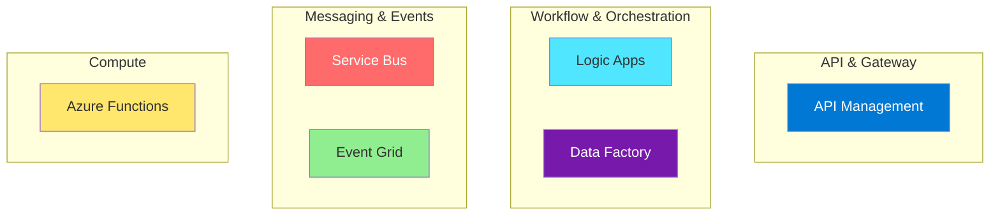

## Quick Reference Table

| Service | Primary Purpose | Best For | Pricing Model |
|---------|-----------------|----------|---------------|
| **API Management** | API gateway & management | API publishing, security, monetization | Per-call + base |
| **Logic Apps** | Workflow automation | Business process automation, B2B | Per-execution |
| **Service Bus** | Enterprise messaging | Reliable messaging, decoupling | Per-operation |
| **Event Grid** | Event routing | Reactive architectures, event distribution | Per-event |
| **Azure Functions** | Serverless compute | Event-driven processing, APIs | Per-execution |
| **Data Factory** | Data integration | ETL/ELT, data pipelines | Per-activity |

## Decision Framework

### When to Use Each Service

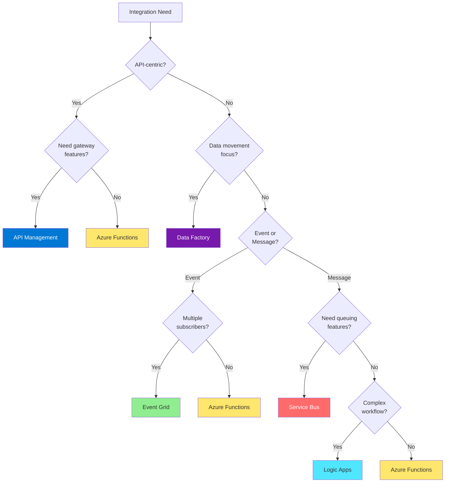

## Events vs Messages

Understanding when to use events versus messages is crucial for choosing between Service Bus and Event Grid.

### Comparison

| Aspect | Events (Event Grid) | Messages (Service Bus) |
|--------|---------------------|------------------------|
| **Purpose** | Notification of state change | Command or data transfer |
| **Content** | What happened | Work to be done |
| **Publisher expectation** | Fire and forget | Expects processing |
| **Consumer count** | Multiple (broadcast) | Single/competing |
| **Coupling** | Very loose | Can be tighter |
| **Ordering** | Not guaranteed | Guaranteed (sessions) |
| **Retention** | Short-term | Configurable |
| **Size** | Small (64KB-1MB) | Up to 100MB (Premium) |

### Decision Matrix

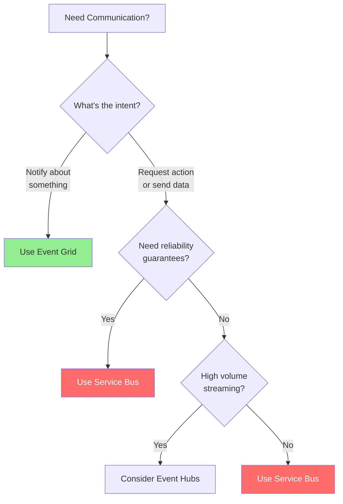

### Examples

| Scenario | Service | Reason |
|----------|---------|--------|
| "Blob was created" | Event Grid | Notification of state change |
| "Process this order" | Service Bus | Work item requiring action |
| "Configuration changed" | Event Grid | Multiple systems need to react |
| "Send invoice to customer" | Service Bus | Reliable delivery required |
| "User logged in" | Event Grid | Audit/notification |
| "Calculate monthly bill" | Service Bus | Task to be processed |

## Logic Apps vs Azure Functions

### Feature Comparison

| Feature | Logic Apps | Azure Functions |
|---------|------------|-----------------|
| **Development** | Visual designer | Code-first |
| **Connectors** | 400+ pre-built | Bindings + custom |
| **State management** | Built-in | Durable Functions |
| **Long-running** | Native support | Durable Functions |
| **B2B/EDI** | Native support | Custom code |
| **Monitoring** | Run history | Application Insights |
| **Cold start** | Possible | Plan-dependent |
| **Cost model** | Per-action | Per-execution |

### When to Choose

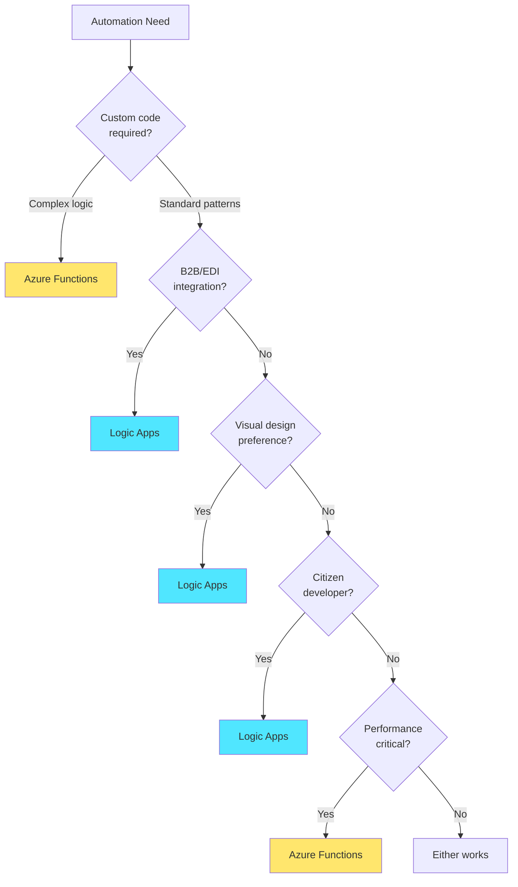

### Scenario Examples

| Scenario | Recommendation | Reason |
|----------|----------------|--------|
| Office 365 automation | Logic Apps | Pre-built connectors |
| High-performance API | Azure Functions | Lower latency |
| SAP integration | Logic Apps | Enterprise connectors |
| Complex algorithms | Azure Functions | Full code control |
| Approval workflows | Logic Apps | Built-in patterns |
| Real-time processing | Azure Functions | Event triggers |

## Data Factory vs Logic Apps

### Feature Comparison

| Feature | Data Factory | Logic Apps |
|---------|--------------|------------|
| **Primary focus** | Data movement | Workflow automation |
| **Data transformation** | Native (Data Flows) | Limited |
| **Connectors** | 90+ data sources | 400+ services |
| **Scale** | Petabyte scale | Business workflow scale |
| **On-premises** | Self-hosted IR | On-premises gateway |
| **Monitoring** | Pipeline monitoring | Run history |
| **CI/CD** | Git integration | ARM/CI integration |

### Decision Matrix

| Scenario | Data Factory | Logic Apps |
|----------|--------------|------------|
| ETL/ELT pipelines | ✓ | |
| Data warehouse loading | ✓ | |
| Scheduled data sync | ✓ | |
| Business workflow | | ✓ |
| B2B integration | | ✓ |
| API orchestration | | ✓ |
| Event reactions | | ✓ |
| Data transformation | ✓ | |

### Combined Architecture

Often these services work together:

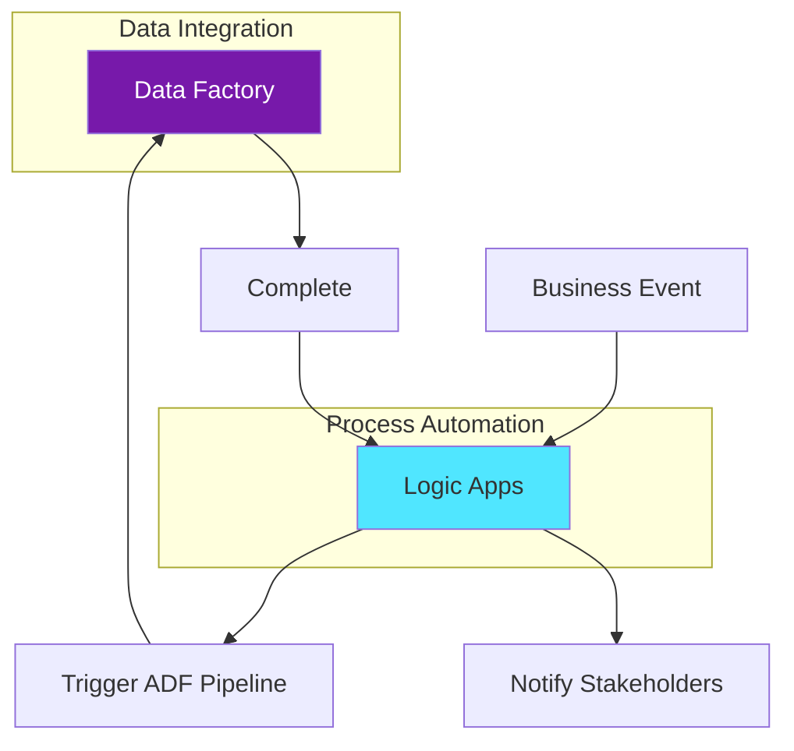

## API Management vs Azure Functions

### When to Use Together vs Separately

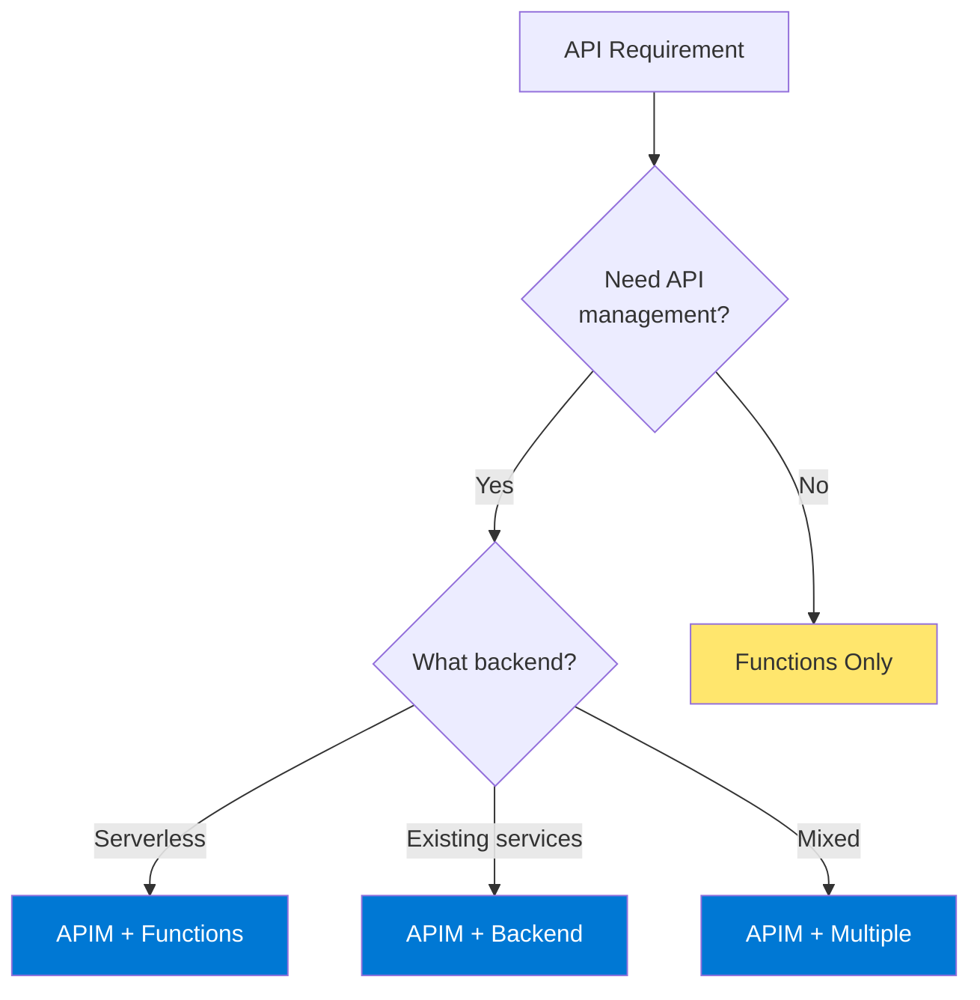

### Feature Matrix

| Capability | Functions Alone | APIM + Functions |
|------------|-----------------|------------------|
| Basic HTTP APIs | ✓ | ✓ |
| Rate limiting | Limited | ✓ |
| API versioning | Manual | Built-in |
| OAuth validation | Code | Policy |
| Caching | Code | Policy |
| Analytics | App Insights | Built-in + App Insights |
| Developer portal | ✗ | ✓ |
| API monetization | ✗ | ✓ |

## Comprehensive Feature Matrix

### Core Capabilities

| Capability | APIM | Logic Apps | Service Bus | Event Grid | Functions | Data Factory |
|------------|------|------------|-------------|------------|-----------|--------------|
| **Serverless** | - | ✓ | - | ✓ | ✓ | Managed |
| **Visual design** | - | ✓ | - | - | - | ✓ |
| **Code-first** | - | ✓ | - | - | ✓ | - |
| **Pre-built connectors** | - | 400+ | - | - | Bindings | 90+ |
| **Event-driven** | - | ✓ | ✓ | ✓ | ✓ | ✓ |
| **Schedule-driven** | - | ✓ | - | - | ✓ | ✓ |

### Enterprise Features

| Capability | APIM | Logic Apps | Service Bus | Event Grid | Functions | Data Factory |
|------------|------|------------|-------------|------------|-----------|--------------|
| **VNet Integration** | ✓ | Std | Premium | ✓ | Premium | ✓ |
| **Private Endpoints** | ✓ | ✓ | ✓ | ✓ | ✓ | ✓ |
| **Managed Identity** | ✓ | ✓ | ✓ | ✓ | ✓ | ✓ |
| **RBAC** | ✓ | ✓ | ✓ | ✓ | ✓ | ✓ |
| **Geo-redundancy** | ✓ | - | ✓ | ✓ | - | - |
| **Customer-managed keys** | ✓ | - | Premium | - | - | ✓ |

## Integration Patterns

### Pattern 1: API-First Architecture

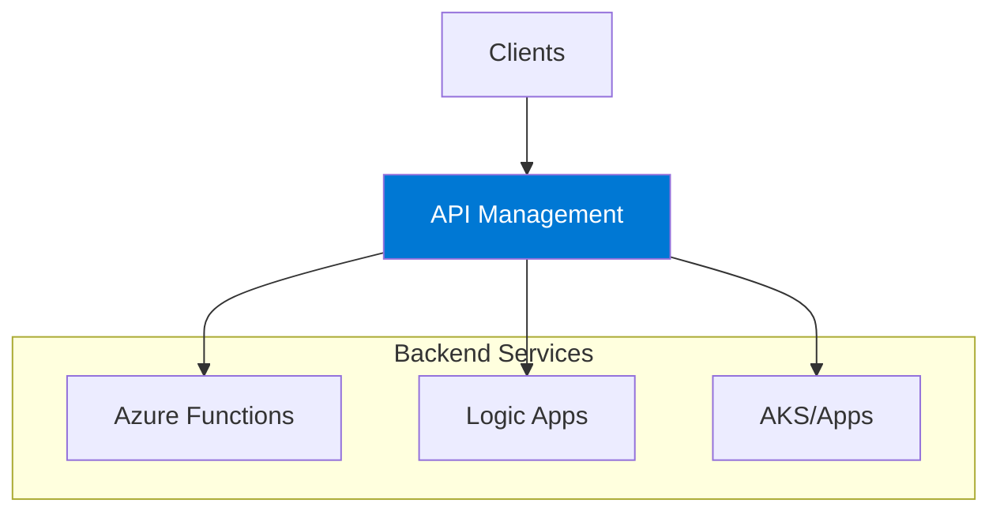

**Services Used:** API Management + Azure Functions/Logic Apps

### Pattern 2: Event-Driven Microservices

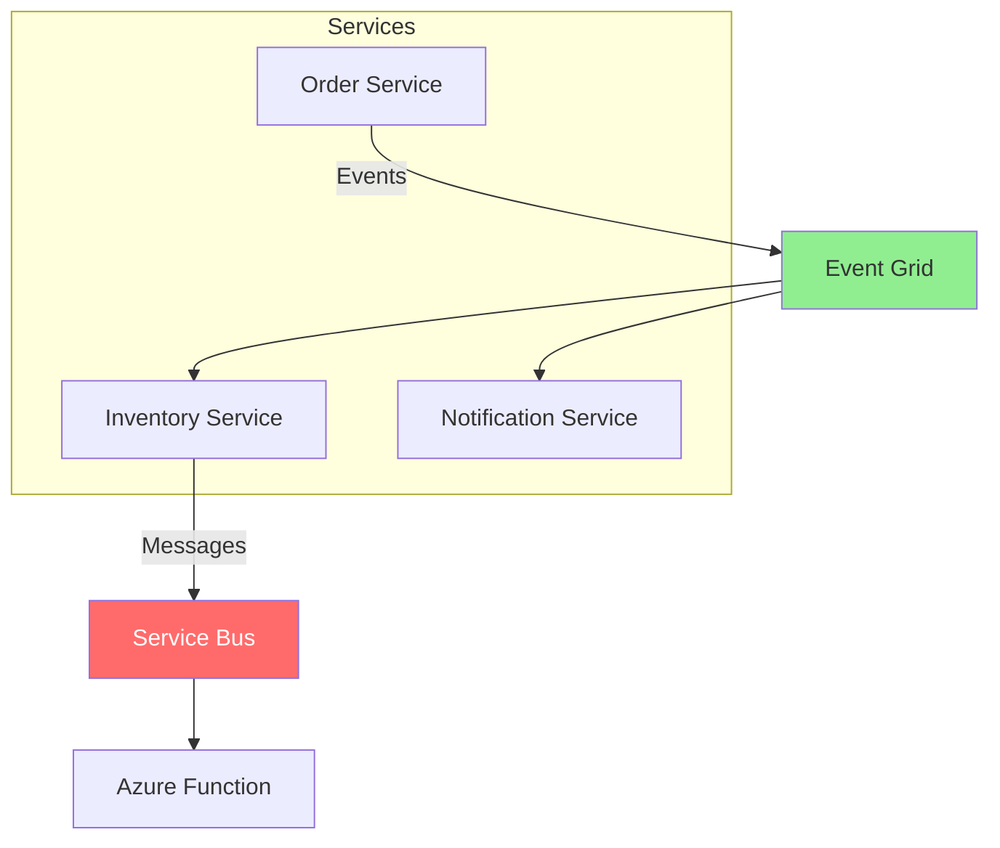

**Services Used:** Event Grid + Service Bus + Azure Functions

### Pattern 3: Enterprise Integration

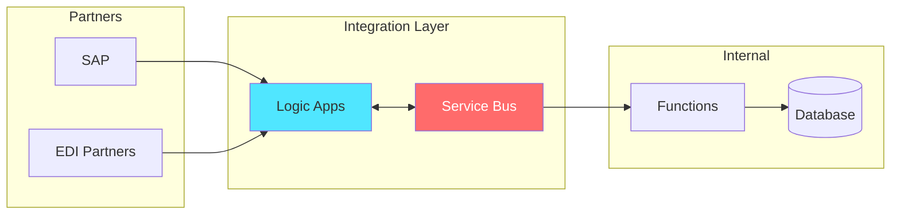

**Services Used:** Logic Apps + Service Bus + Azure Functions

### Pattern 4: Data Integration

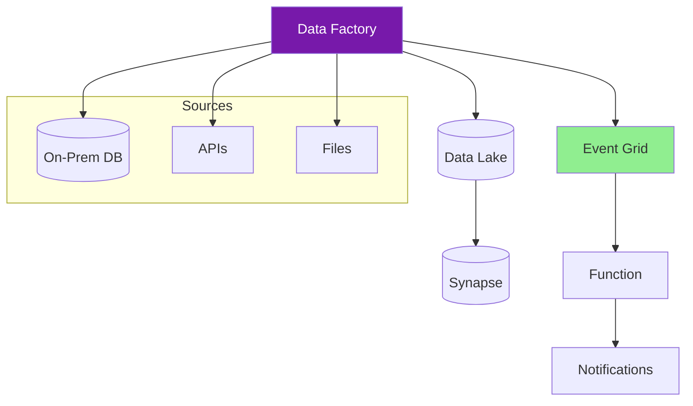

**Services Used:** Data Factory + Event Grid + Azure Functions

## Cost Comparison

### Pricing Models

| Service | Model | Key Factors |
|---------|-------|-------------|
| **API Management** | Tier-based + calls | Tier, API calls, bandwidth |
| **Logic Apps** | Per-execution | Actions, connectors, runtime |
| **Service Bus** | Per-operation | Messages, tier, size |
| **Event Grid** | Per-event | Events published, operations |
| **Azure Functions** | Per-execution | Executions, GB-seconds |
| **Data Factory** | Per-activity | Activities, DIU, data flow |

### Cost Optimization Tips

| Service | Tip |
|---------|-----|
| **APIM** | Choose appropriate tier, use caching |
| **Logic Apps** | Use Standard for high volume, built-in connectors |
| **Service Bus** | Batch messages, choose right tier |
| **Event Grid** | Filter events at subscription |
| **Functions** | Use consumption for sporadic, Premium for consistent |
| **Data Factory** | Right-size DIUs, use incremental loads |

## Migration Paths

### From On-Premises to Azure

| On-Premises | Azure Service | Migration Path |
|-------------|---------------|----------------|
| BizTalk Server | Logic Apps | Assess → Migrate connectors → Refactor workflows |
| SSIS | Data Factory | Azure-SSIS IR or refactor to ADF |
| MQ/MSMQ | Service Bus | Message mapping → Queue migration |
| Custom ETL | Data Factory | Pipeline-by-pipeline conversion |
| API Gateway | APIM | Import APIs → Migrate policies |

## Hybrid Scenarios

### Connectivity Options

| Service | Hybrid Connectivity |
|---------|---------------------|
| **API Management** | Self-hosted gateway, VPN |
| **Logic Apps** | On-premises data gateway |
| **Service Bus** | Hybrid Connections |
| **Event Grid** | Partner topics, webhooks |
| **Functions** | Hybrid Connections, VNet |
| **Data Factory** | Self-hosted Integration Runtime |

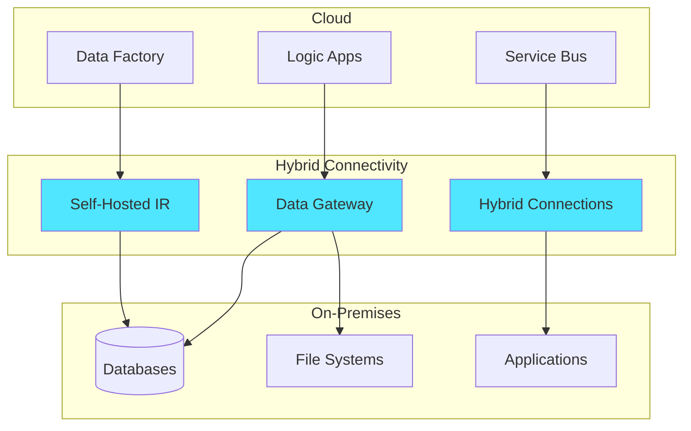

## Recommendations by Scenario

### Web/Mobile Backend

**Recommended:** API Management + Azure Functions
- Functions for API logic
- APIM for management, security, caching

### Business Process Automation

**Recommended:** Logic Apps + Service Bus
- Logic Apps for orchestration
- Service Bus for reliable messaging

### Real-Time Event Processing

**Recommended:** Event Grid + Azure Functions
- Event Grid for event routing
- Functions for event processing

### Enterprise Data Integration

**Recommended:** Data Factory + Logic Apps
- Data Factory for ETL/ELT
- Logic Apps for workflow triggers

### B2B Integration

**Recommended:** Logic Apps (Standard)
- Enterprise connectors
- B2B protocols (EDI, AS2)
- Integration accounts

### IoT Integration

**Recommended:** Event Grid + Functions + Service Bus
- Event Grid for IoT Hub events
- Functions for processing
- Service Bus for command delivery

## Summary Decision Tree

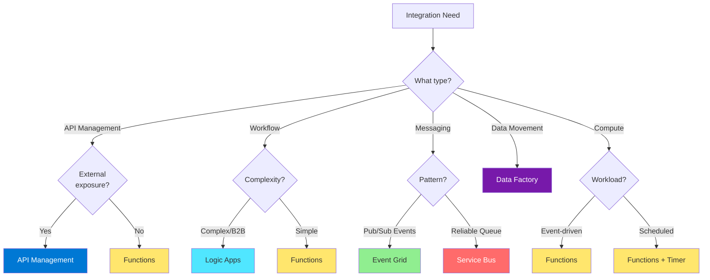

---

## References

- [Azure Integration Services](https://azure.microsoft.com/en-us/products/category/integration/)
- [Choose an Azure integration service](https://learn.microsoft.com/en-us/azure/architecture/guide/technology-choices/integration-services)
- [Enterprise Integration Patterns](https://learn.microsoft.com/en-us/azure/architecture/patterns/)
- [Azure Architecture Center - Integration](https://learn.microsoft.com/en-us/azure/architecture/guide/architecture-styles/event-driven)
- [Events vs Messages](https://learn.microsoft.com/en-us/azure/event-grid/compare-messaging-services)
