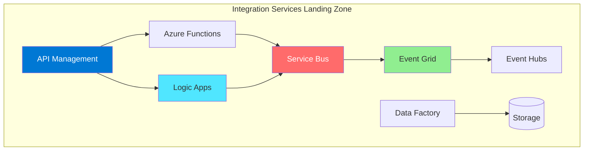
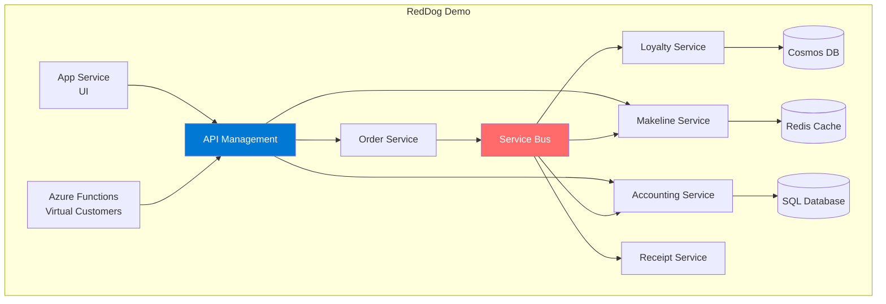
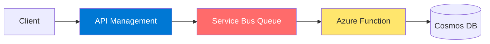
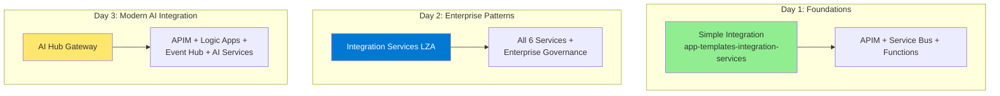

# Azure Integration Services - Sample Recommendations

## Executive Summary

After analyzing multiple Azure-Samples repositories, Microsoft patterns & practices, and samples in your workspace, I've identified the **best end-to-end samples** that showcase Azure Integration Services for workshop demonstrations.

> **Note:** All workspace samples are available in your GitHub account at: https://github.com/CalinL/

## Top Recommended Samples

### 🥇 #1 BEST OVERALL: Integration Services Landing Zone Accelerator

**Repository:** [Azure/Integration-Services-Landing-Zone-Accelerator](https://github.com/Azure/Integration-Services-Landing-Zone-Accelerator)

#### Services Demonstrated

| Service | Usage in Sample |
|---------|-----------------|
| ✅ **API Management** | Central API gateway |
| ✅ **Azure Functions** | Serverless compute |
| ✅ **Logic Apps** | Workflow orchestration |
| ✅ **Service Bus** | Messaging backbone |
| ✅ **Event Grid** | Event routing |
| ✅ **Event Hubs** | Event streaming |
| ✅ **Data Factory** | Data integration |
| ✅ **Storage Accounts** | Data storage |

#### Why This is the Best Choice

This is the **official Microsoft Cloud Adoption Framework** reference implementation for Azure Integration Services!



**Strengths:**
- ✅ **Covers ALL 6+ Azure Integration Services** in one deployment
- ✅ Official Microsoft Cloud Adoption Framework guidance
- ✅ Enterprise-scale landing zone architecture
- ✅ Bicep/ARM templates for deployment
- ✅ Design considerations and recommendations for each service
- ✅ Two reference implementation scenarios included
- ✅ Identity, Network, Security, Governance guidance

**Workshop Demo Flow:**
1. Deploy the landing zone with all integration services
2. Walk through each design area (Identity, Network, Security)
3. Show ServiceNow integration scenario
4. Demonstrate enterprise governance patterns

---

### 🥈 #2 MODERN & ACTIVELY MAINTAINED: Serverless Chat with RAG (LangChain.js)

**Repository:** [Azure-Samples/serverless-chat-langchainjs](https://github.com/Azure-Samples/serverless-chat-langchainjs)

#### Services Demonstrated

| Service | Usage in Sample |
|---------|-----------------|
| ✅ **Azure Functions** | Serverless API backend |
| ✅ **Static Web Apps** | Web hosting |
| ✅ **Cosmos DB** | Vector database + chat history |
| ✅ **Azure OpenAI** | LLM integration |
| ✅ **Blob Storage** | Document storage |
| ❌ APIM | Not used |
| ❌ Service Bus | Not used |

**Why Consider This:**
- 🔥 Modern AI/RAG pattern (most relevant for 2024+)
- 📅 Actively maintained (updated October 2024)
- 🚀 Azure Developer CLI (azd) compatible
- 📚 Comprehensive documentation and tutorials
- 💻 Local development with Ollama support

---

### 🥉 #3 AI HUB GATEWAY: Enterprise AI Governance

**Repository:** [Azure-Samples/ai-hub-gateway-solution-accelerator](https://github.com/Azure-Samples/ai-hub-gateway-solution-accelerator)

#### Services Demonstrated

| Service | Usage in Sample |
|---------|-----------------|
| ✅ **API Management** | Central AI gateway with intelligent routing |
| ✅ **Event Hub** | Usage data streaming |
| ✅ **Logic Apps** | Event processing & transformation |
| ✅ **Cosmos DB** | Usage analytics |
| ✅ **Azure OpenAI** | Multi-region AI deployments |
| ✅ **App Insights** | Real-time monitoring |

**Why Consider This:**
- 🔥 **Latest enterprise AI governance patterns** (Dec 2024)
- 🛡️ PII detection & masking
- 📊 Power BI dashboards for cost allocation
- 🔐 Zero Trust with Entra ID
- 🚀 One-click deploy with Azure Developer CLI

---

### 🏅 #4 IN YOUR WORKSPACE: app-templates-microservices-integration (RedDog)

**Repository:** [Azure-Samples/app-templates-microservices-integration](https://github.com/Azure-Samples/app-templates-microservices-integration)

**Also forked at:** https://github.com/CalinL/app-templates-microservices-integration

#### Services Demonstrated

| Service | Usage in Sample |
|---------|-----------------|
| ✅ **API Management** | Gateway for all microservices |
| ✅ **Azure Functions** | Virtual Customers |
| ✅ **Service Bus** | Pub/sub between microservices |
| ✅ **Cosmos DB** | Loyalty service state |
| ✅ **Container Apps** | Microservices hosting |
| ❌ Event Grid | Not directly used |
| ❌ Logic Apps | Not included |
| ❌ Data Factory | Not included |

#### Architecture



**Strengths:**
- ✅ Already forked in your GitHub account
- ✅ Shows **Service Bus** messaging patterns (pub/sub)
- ✅ Container Apps + Functions + App Service hosting variety
- ✅ Dapr integration for messaging abstraction
- ✅ Quick deploy script available
- ✅ Azure Developer CLI (azd) compatible

---

### 🏅 #5 SIMPLEST QUICK DEMO: app-templates-integration-services

**Repository:** [Azure-Samples/app-templates-integration-services](https://github.com/Azure-Samples/app-templates-integration-services)

**Also forked at:** https://github.com/CalinL/app-templates-integration-services

#### Services Demonstrated

| Service | Usage in Sample |
|---------|-----------------|
| ✅ **API Management** | Receives HTTP requests |
| ✅ **Service Bus** | Message queuing |
| ✅ **Azure Functions** | Queue processor |
| ✅ **Cosmos DB** | Data storage |
| ❌ Event Grid | Not used |
| ❌ Logic Apps | Not used |
| ❌ Data Factory | Not used |

#### Architecture



**Strengths:**
- ✅ Simplest architecture (easy to explain)
- ✅ Already forked in your GitHub account
- ✅ Fast deployment (~1 hour including APIM)
- ✅ Clear data flow: API → Queue → Function → Database
- ✅ Demonstrates managed identity authentication

---

### 🎖️ #6 BONUS: Invoice Process Automation (Logic Apps Focus)

**Repository:** [Azure-Invoice-Process-Automation-Solution-Accelerator](https://github.com/microsoft/Azure-Invoice-Process-Automation-Solution-Accelerator)

**Also forked at:** https://github.com/githubabcs-devops/Azure-Invoice-Process-Automation-Solution-Accelerator

#### Services Demonstrated

| Service | Usage in Sample |
|---------|-----------------|
| ✅ **Logic Apps** | Workflow orchestration |
| ✅ **Cosmos DB** | Invoice data storage |
| ✅ **Form Recognizer** | AI document processing |
| ✅ **Blob Storage** | Document storage |
| ❌ API Management | Not used |
| ❌ Service Bus | Not used |
| ❌ Event Grid | Not used |

**Best For:** Demonstrating **Logic Apps** with AI integration and document processing workflows.

---

### 🎖️ BONUS: Cloud Design Patterns (Microsoft Patterns & Practices)

**Repository:** [mspnp/cloud-design-patterns](https://github.com/mspnp/cloud-design-patterns)

**⭐ Stars:** 842 | **🔄 Forks:** 305 | **📅 Updated:** December 2024 (actively maintained!)

#### Patterns Included

| Pattern | Description |
|---------|-------------|
| **Async Request-Reply** | HTTP polling pattern |
| **Choreography** | Event-driven coordination |
| **Claim Check** | Large message handling |
| **Pipes & Filters** | Message processing |
| **Priority Queue** | Service Bus queues |
| **Saga** | Distributed transactions |
| **Valet Key** | Secure storage access |

**Why Consider This:**
- 🔥 **Actively maintained** (updated 3 days ago!)
- 📚 Official Azure Architecture Center companion code
- 🎯 Individual patterns you can extract and demonstrate
- 💡 Perfect for teaching specific integration patterns

---

## Comparison Matrix

| Sample | APIM | Functions | Logic Apps | Service Bus | Event Grid | Data Factory | Last Updated | Ease of Deploy |
|--------|:----:|:---------:|:----------:|:-----------:|:----------:|:------------:|:------------:|:--------------:|
| **Integration Services LZA** | ✅ | ✅ | ✅ | ✅ | ✅ | ✅ | Sep 2024 | ⭐⭐⭐ |
| **Serverless Chat (LangChain)** | ❌ | ✅ | ❌ | ❌ | ❌ | ❌ | Oct 2024 | ⭐⭐⭐⭐⭐ |
| **AI Hub Gateway** | ✅ | ❌ | ✅ | ❌ | ✅ | ❌ | Nov 2024 | ⭐⭐⭐⭐ |
| **RedDog (microservices-integration)** | ✅ | ✅ | ❌ | ✅ | ❌ | ❌ | 2024 | ⭐⭐⭐⭐ |
| **Integration Services (simple)** | ✅ | ✅ | ❌ | ✅ | ❌ | ❌ | 2024 | ⭐⭐⭐⭐⭐ |
| **Cloud Design Patterns** | ❌ | ✅ | ❌ | ✅ | ❌ | ❌ | Dec 2024 | ⭐⭐⭐⭐ |

---

## Workshop Strategy Recommendation

### For L200-L300 Workshop: Combine Multiple Samples



### Quick Demo (30-60 minutes)
**Use:** `app-templates-integration-services` (https://github.com/CalinL/app-templates-integration-services)
- Deploy with single `az deployment` command
- Show API call → Service Bus → Function → Cosmos DB
- Simple, clear flow

### Half-Day Workshop
**Use:** `Integration Services Landing Zone Accelerator`
- Clone and deploy the landing zone
- Walk through enterprise architecture patterns
- Show all 6+ integration services working together
- Enterprise governance and security considerations

### Full Day Workshop
**Combine:**
1. Start with simple sample (app-templates-integration-services)
2. Introduce enterprise patterns (Integration Services LZA)
3. Show AI integration (AI Hub Gateway or Serverless Chat)
4. Design patterns deep-dive (mspnp/cloud-design-patterns)

---

## Deployment Commands

### Integration Services Landing Zone Accelerator

```bash
git clone https://github.com/Azure/Integration-Services-Landing-Zone-Accelerator.git

# Follow the scenario-specific deployment guide
# Scenario 1: Enterprise AIS deployment
# Scenario 2: ServiceNow integration
```

### app-templates-integration-services

```bash
# Clone from your fork
git clone https://github.com/CalinL/app-templates-integration-services.git
cd app-templates-integration-services

az deployment sub create \
  --name "integration-demo" \
  --location "eastus" \
  --template-file infra/main.bicep \
  --parameters name="demo" \
    publisherEmail="your-email@example.com" \
    publisherName="Workshop Demo"
```

### app-templates-microservices-integration (RedDog)

```bash
# Clone from your fork
git clone https://github.com/CalinL/app-templates-microservices-integration.git
cd app-templates-microservices-integration

chmod +x ./deploy.sh
./deploy.sh -n demo -l eastus2 -c <unique-code>
```

### AI Hub Gateway Solution Accelerator

```bash
git clone https://github.com/Azure-Samples/ai-hub-gateway-solution-accelerator.git
cd ai-hub-gateway-solution-accelerator

# One-click deploy with Azure Developer CLI
azd auth login
azd env new ai-hub-gateway-dev
azd up
```

### Serverless Chat with LangChain.js

```bash
git clone https://github.com/Azure-Samples/serverless-chat-langchainjs.git
cd serverless-chat-langchainjs

# Deploy to Azure
azd auth login
azd up
```

---

## Missing Service: Azure Data Factory

**Note:** Most integration samples don't prominently feature **Azure Data Factory** as it's typically used for batch data movement rather than real-time integration. For Data Factory demos, consider:

1. **Create a separate Data Factory demo** using:
   - [Azure-Samples data factory tutorials](https://github.com/Azure/azure-quickstart-templates/tree/master/quickstarts/microsoft.datafactory)
   - Microsoft Learn modules for hands-on labs

2. **Data Factory Use Case Addition:**
   - Add a data pipeline to any sample that:
     - Loads historical data into Cosmos DB
     - Aggregates order data for reporting
     - Syncs data between systems

---

## Final Recommendation

| Workshop Goal | Recommended Sample | Repository |
|---------------|-------------------|------------|
| **Complete Integration Services coverage** | Integration Services Landing Zone Accelerator | [Azure/Integration-Services-Landing-Zone-Accelerator](https://github.com/Azure/Integration-Services-Landing-Zone-Accelerator) |
| **Quick 30-min demo** | app-templates-integration-services | [CalinL/app-templates-integration-services](https://github.com/CalinL/app-templates-integration-services) |
| **Modern AI + Integration** | AI Hub Gateway | [Azure-Samples/ai-hub-gateway-solution-accelerator](https://github.com/Azure-Samples/ai-hub-gateway-solution-accelerator) |
| **Microservices + Service Bus** | RedDog Demo | [CalinL/app-templates-microservices-integration](https://github.com/CalinL/app-templates-microservices-integration) |
| **Individual design patterns** | Cloud Design Patterns | [mspnp/cloud-design-patterns](https://github.com/mspnp/cloud-design-patterns) |
| **Modern RAG/AI demo** | Serverless Chat LangChain.js | [Azure-Samples/serverless-chat-langchainjs](https://github.com/Azure-Samples/serverless-chat-langchainjs) |

---

## Resources

### Official Microsoft References
- [Integration Services Landing Zone Accelerator](https://github.com/Azure/Integration-Services-Landing-Zone-Accelerator)
- [Cloud Design Patterns (mspnp)](https://github.com/mspnp/cloud-design-patterns)
- [Azure Architecture Center - Integration](https://learn.microsoft.com/en-us/azure/architecture/reference-architectures/enterprise-integration/)

### Modern AI + Integration
- [AI Hub Gateway Solution Accelerator](https://github.com/Azure-Samples/ai-hub-gateway-solution-accelerator)
- [Serverless Chat with LangChain.js](https://github.com/Azure-Samples/serverless-chat-langchainjs)

### Your Workspace Samples
- [app-templates-integration-services](https://github.com/CalinL/app-templates-integration-services)
- [app-templates-microservices-integration](https://github.com/CalinL/app-templates-microservices-integration)

### Azure Developer CLI Templates
- [Awesome AZD Templates](https://azure.github.io/awesome-azd/)
